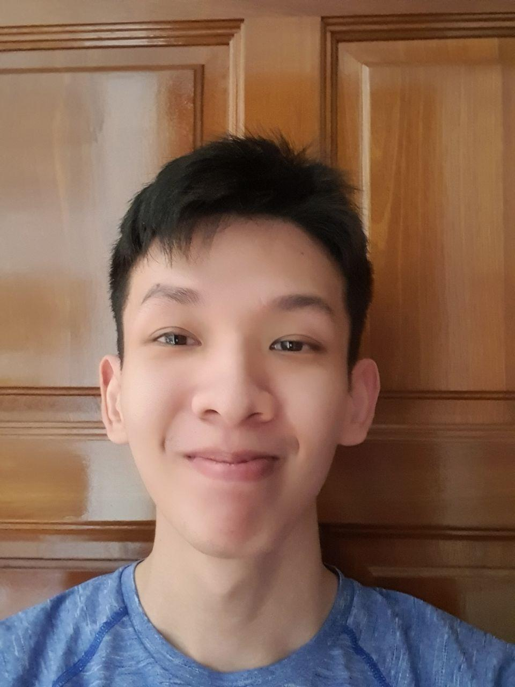
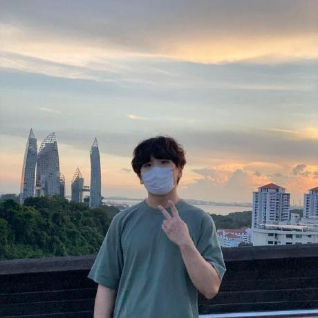
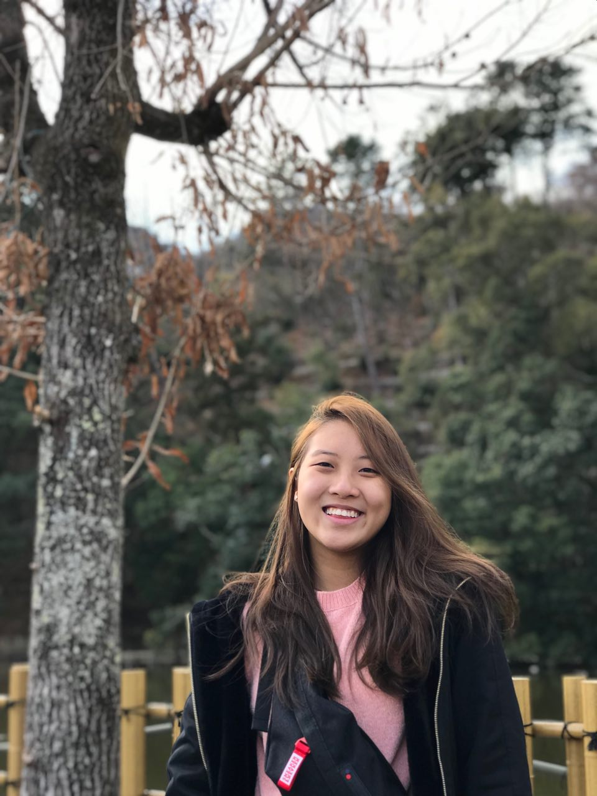

We are a CS2103T project team based in the [School of Computing, National University of Singapore](http://www.comp.nus.edu.sg).

You can reach us at the email `seer[at]comp.nus.edu.sg`

## Project team

### Toh Hong Xian

[[github](https://github.com/raythx98)]
[[portfolio](team/raythx98.md)]

* Role: Developer
* Responsibilities: Deliverables and Deadlines

### Lee Joon Jie

[[github](http://github.com/BreadPeanutButter)]
[[portfolio](team/breadpeanutbutter.md)]

* Role: Developer
* Responsibilities: Code Quality

### Germaine Tan

[[github](http://github.com/g-erm)] [[portfolio](team/g-erm.md)]

* Role: Developer
* Responsibilities: Testing

### Nigel Ng

[[github](http://github.com/vanGoghhh)]
[[portfolio](team/vangoghhh.md)]

* Role: Developer
* Responsibilities: UI

### Amelia Tan

[[github](http://github.com/ameliatjy)]
[[portfolio](team/ameliatjy.md)]

* Role: Developer
* Responsibilities: Scheduling and Tracking
