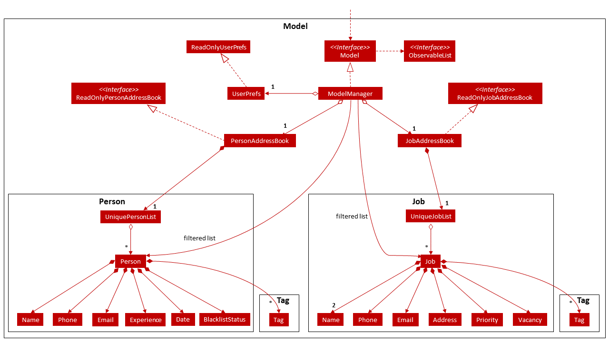
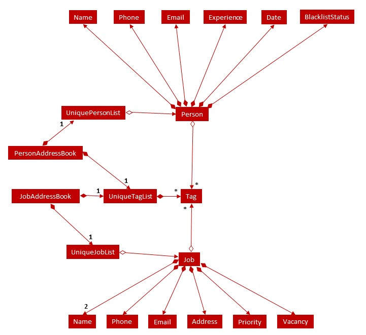

* Table of Contents
{:toc}

--------------------------------------------------------------------------------------------------------------------

## **Setting up, getting started**

Refer to the guide [_Setting up and getting started_](SettingUp.md).

--------------------------------------------------------------------------------------------------------------------

## **Design**

### Architecture

The ***Architecture Diagram*** given above explains the high-level design of the App. Given below is a quick overview of each component.

:bulb: **Tip:** The `.puml` files used to create diagrams in this document can be found in the [diagrams](https://github.com/se-edu/addressbook-level3/tree/master/docs/diagrams/) folder. Refer to the [_PlantUML Tutorial_ at se-edu/guides](https://se-education.org/guides/tutorials/plantUml.html) to learn how to create and edit diagrams.

**`Main`** has two classes called [`Main`](https://github.com/se-edu/addressbook-level3/tree/master/src/main/java/seedu/address/Main.java) and [`MainApp`](https://github.com/se-edu/addressbook-level3/tree/master/src/main/java/seedu/address/MainApp.java). It is responsible for,
* At app launch: Initializes the components in the correct sequence, and connects them up with each other.
* At shut down: Shuts down the components and invokes cleanup methods where necessary.

[**`Commons`**](#common-classes) represents a collection of classes used by multiple other components.

The rest of the App consists of four components.

* [**`UI`**](#ui-component): The UI of the App.
* [**`Logic`**](#logic-component): The command executor.
* [**`Model`**](#model-component): Holds the data of the App in memory.
* [**`Storage`**](#storage-component): Reads data from, and writes data to, the hard disk.

Each of the four components,

* defines its *API* in an `interface` with the same name as the Component.
* exposes its functionality using a concrete `{Component Name}Manager` class (which implements the corresponding API `interface` mentioned in the previous point.

For example, the `Logic` component (see the class diagram given below) defines its API in the `Logic.java` interface and exposes its functionality using the `LogicManager.java` class which implements the `Logic` interface.

**How the architecture components interact with each other**

The *Sequence Diagram* below shows how the components interact with each other for the scenario where the user issues the command `delete can 1`.

The sections below give more details of each component.

### UI component

**API** :
[`Ui.java`](https://github.com/se-edu/addressbook-level3/tree/master/src/main/java/seedu/address/ui/Ui.java)

The UI consists of a `MainWindow` that is made up of parts e.g.`CommandBox`, `ResultDisplay`, `PersonListPanel`, `StatusBarFooter` etc. All these, including the `MainWindow`, inherit from the abstract `UiPart` class.

The `UI` component uses JavaFx UI framework. The layout of these UI parts are defined in matching `.fxml` files that are in the `src/main/resources/view` folder. For example, the layout of the [`MainWindow`](https://github.com/se-edu/addressbook-level3/tree/master/src/main/java/seedu/address/ui/MainWindow.java) is specified in [`MainWindow.fxml`](https://github.com/se-edu/addressbook-level3/tree/master/src/main/resources/view/MainWindow.fxml)

The `UI` component,

* Executes user commands using the `Logic` component.
* Listens for changes to `Model` data so that the UI can be updated with the modified data.

### Logic component

**API** :
[`Logic.java`](https://github.com/se-edu/addressbook-level3/tree/master/src/main/java/seedu/address/logic/Logic.java)

1. `Logic` uses the `AddressBookParser` class to parse the user command.
1. This results in a `Command` object which is executed by the `LogicManager`.
1. The command execution can affect the `Model` (e.g. adding a person).
1. The result of the command execution is encapsulated as a `CommandResult` object which is passed back to the `Ui`.
1. In addition, the `CommandResult` object can also instruct the `Ui` to perform certain actions, such as displaying help to the user.

Given below is the Sequence Diagram for interactions within the `Logic` component for the `execute("delete 1")` API call.

:information_source: **Note:** The lifeline for `DeleteCommandParser` should end at the destroy marker (X) but due to a limitation of PlantUML, the lifeline reaches the end of diagram.

### Model component

**API** : [`Model.java`](https://github.com/se-edu/addressbook-level3/tree/master/src/main/java/seedu/address/model/Model.java)

The `Model`,

* stores a `UserPref` object that represents the user’s preferences.
* stores the address book data.
* exposes an unmodifiable `ObservableList<Person>` and an unmodifiable `ObservableList<Job>` that can be 'observed' e.g. the UI can be bound to these lists so that the UI automatically updates when the data in the lists change.
* does not depend on any of the other three components.

:information_source: **Note:** An alternative (arguably, a more OOP) model is given below. It has a `Tag` list in `PersonAddressBook` and `JobAddressBook`, which `Person` and `Job` references respectively. This allows `PersonAddressBook` and `JobAddressBook` to each only require one `Tag` object per unique `Tag`, instead of each `Person` and each `Job` needing their own `Tag` object. 

### Storage component

**API** : [`Storage.java`](https://github.com/se-edu/addressbook-level3/tree/master/src/main/java/seedu/address/storage/Storage.java)

The `Storage` component,
* can save `UserPref` objects in json format and read it back.
* can save both the person address book data and job address book data in json format and read it back.

### Common classes

Classes used by multiple components are in the `seedu.addressbook.commons` package.

--------------------------------------------------------------------------------------------------------------------

## **Implementation**

This section describes some noteworthy details on how certain features are implemented.

### \[Implemented] Add feature

The Add feature exists for editing candidates, using `add can`, and jobs by using `add job`.

Both implemented add mechanisms are facilitated by `ModelManager`. They both implement `Model` and contain `FilteredList`s of filtered `Person`s and filtered `Job`s. `FilteredList` is a subclass of `ObservableList`.
Additionally, it implements the following operations:

*`ModelManager#hasPerson(Person person)` —  Check whether the same person exist in the FilteredList of persons using the `equals` method of `Persons`.
*`ModelManager#addPerson(Person person)` —  Adds the person into the FilteredList of persons.
*`ModelManager#hasJob(Job job)` —  Check whether the same job exist in the FilteredList of jobs using the `equals` method of `Jobs`.
*`ModelManager#addJob(Job job)` —  Adds the job into the FilteredList of jobs.

Given below is an example usage scenario and how the add mechanism behaves at each step. We will show the example for person, but the scenario for jobs are mostly similar

Step 1. The user launches the application for the first time. The `FilteredList` will be initialised with the `UniquePersonList` from `personAddressBook` which contains a list of candidates.

Step 2. The user executes `add can n/John` to add a candidate with `Name` John.

Step 3. The method `AddressBookParser#parseCommand` is invoked to determine the command type. Since this is an `add can` command,
the `AddPersonCommandParser#parse` is then invoked to parse the arguments.
If the input command has an invalid format, `AddPersonCommandParser` throws a `ParseException`, if not, a `AddJobCommand` object is created.

Step 4. `ModelManager#hasJob(Person person)` is invoked to check whether the same person exist in the FilteredList of persons using the `equals` method of `Persons`. If a duplicate person exists, a `CommandException` is thrown. Otherwise, the method `ModelManager#addPerson(Person person)` is invoked to adds the person into the FilteredList of persons.

Step 5. The `savePersonAddressBook` method of `StorageManager`, which is a subclass of `Storage` is invoked to update the new person addition in the `personAddressBook` and saved. 

The following sequence diagram shows how the add operation works in the scenario described above:

### \[Implemented] Sort Candidates feature

The implemented sort mechanism is facilitated by `ModelManager`. It implements `Model` and contains a `SortedList`, which is a subclass of `ObservableList`.
Additionally, it implements the following operations:

*`ModelManager#updateSortedPersonList(Comparator<Person> comp)` —  Sorts the current SortedList of persons using the supplied comparator.

Given below is an example usage scenario and how the sort mechanism behaves at each step.

Step 1. The user launches the application for the first time. The `SortedList` will be initialised with the `UniquePersonList` from `personAddressBook` which contains a list of candidates.

Step 2. The user executes `sort can exp/asc` to sort the candidates by their `Experience` in ascending order. If the comparator field e.g. `exp` or the order e.g `asc` is missing, `SortPersonCommandParser` throws an error message.

Step 3. The user executes `sort can exp/asc` to sort the candidates by their `Experience` in ascending order. A `PersonExperienceComparator` is created from parsing the command and a `SortPersonCommand` object is created. In the `SortPersonCommand#execute` the method `ModelManager#updateSortedPersonList(PersonExperienceComparator)` is invoked and the `SortedList` is sorted using the `PersonExperienceComparator`. The `UniquePersonList` in `personAddressBook` is then set to be the `SortedList`.

### \[Implemented] Find feature

The implemented find mechanism is facilitated by `ModelManager`. It implements `Model` and contains a `FilteredList`, which is a subclass of `ObservableList`.
Additionally, it implements the following operations:

*`ModelManager#updateFilteredPersonList(Predicate<Person> predicate)` —  Updates the FilteredList of persons using the supplied predicate.

Given below is an example usage scenario and how the find mechanism behaves at each step.

Step 1. The user launches the application for the first time. The `FilteredList` will be initialised with the `UniquePersonList` from `personAddressBook` which contains a list of candidates.

Step 2. The user executes `find can n/John` to find candidates with the `Name` John.

Step 3. A `PersonNameContainsKeywordsPredicate`, which is a subclass of `Predicate` is created from parsing the command and a `FindCommand` object is created. In the `FindCommand#execute` the method `ModelManager#updateFilteredPersonList(PersonNameContainsKeywordsPredicate)` is invoked and the `FilteredList` is filtered using the `PersonNameContainsKeywordsPredicate`.

The following sequence diagram shows how the find operation works in the scenario described above:

The find operation is subjected to improvements to be implemented in v1.3 where we will allow users to find candidates or jobs using other fields like address, tags, vacancy, etc.

### \[Implemented] List Job feature

The implemented list mechanism is facilitated by `ModelManager`. It implements `Model` and contains a `FilteredList`, which is a subclass of `ObservableList`.
Additionally, it implements the following operations:

*`ModelManager#updateFilteredJobList(Predicate<Job> predicate)` —  Updates the FilteredList of jobs using the supplied predicate.

Given below is an example usage scenario and how the list mechanism behaves at each step.

Step 1. The user launches the application for the first time. The `FilteredList` will be initialised with the `UniqueJobList` from `jobAddressBook` which contains a list of jobs.

Step 2. The user executes `list job` to list all jobs.

Step 3. A `ListJobCommand` object is created from parsing the command. In the `ListJobCommand#execute` the method `ModelManager#updateFilteredJobList(PREDICATE_SHOW_ALL_JOBS)` is invoked 
and the `FilteredList` shows all jobs in the list as indicated by the given predicate.

The following sequence diagram shows how the find operation works in the scenario described above:

### \[Implemented] Edit feature

The Edit feature has two variants, one for editing candidates (`edit can`) and one for editing jobs (`edit job`) . We will illustrate this feature using only the candidates variant here
as the job variant works analogously. 
The implemented edit mechanism is facilitated by `ModelManager`.  It implements `Model` and contains a `FilteredList`, which is a subclass of `ObservableList`. 
Additionally, it implements the following operations:

*`ModelManager#setPerson(Person target, Person editedPerson)` —  Replaces the Person target  with editedPerson.
*`ModelManager#updateFilteredPersonList(Predicate<Person> predicate)` —  Updates the FilteredList of persons using the supplied predicate.

Given below is an example usage scenario and how the edit mechanism behaves at each step.

Step 1. The user launches the application for the first time. The `FilteredList` will be initialised with the `UniquePersonList` from `personAddressBook` which contains a list of candidates.

Step 2. The user executes `edit can 2 n/Rob Mi e/rob@kmail.com` to change the `Name` and `Email` of the candidate at index 2 to Rob Mi and rob@kmail.com respectively. 

Step 3. The method `AddressBookParser#parseCommand` is invoked to distinguish which type of command it is. After discerning it is an `edit can` command,
the `EditPersonCommandParser#parse` is then invoked to parse the arguments.
If the command format is invalid, `EditPersonCommandParser` throws an error.

Step 4. A `EditPersonDescriptor`, which is an inner class of `EditPersonCommand`, is created from parsing the command and a `EditPersonCommand` object is created. In the `EditPersonCommand#execute` method, if the candidate index provided by the user is invalid, an error is thrown. 
Otherwise, the method `ModelManager#setPerson()` is invoked to replace the old candidate with the newly edited candidate. 
 Then, `ModelManager#updateFilteredPersonList()` is invoked and the `FilteredList` is updated.
The `personAddressBook` is also updated with the new changes and saved. 

The following sequence diagram shows how the edit operation works in the scenario described above:

A `edit job` command works similarly for Jobs but with the analogous EditJobDescriptor, EditJobCommand, JobAddressBook etc. classes.

### \[Proposed\] Undo/redo feature

#### Proposed Implementation

The proposed undo/redo mechanism is facilitated by `VersionedAddressBook`. It extends `AddressBook` with an undo/redo history, stored internally as an `addressBookStateList` and `currentStatePointer`. Additionally, it implements the following operations:

* `VersionedAddressBook#commit()` — Saves the current address book state in its history.
* `VersionedAddressBook#undo()` — Restores the previous address book state from its history.
* `VersionedAddressBook#redo()` — Restores a previously undone address book state from its history.

These operations are exposed in the `Model` interface as `Model#commitAddressBook()`, `Model#undoAddressBook()` and `Model#redoAddressBook()` respectively.

Given below is an example usage scenario and how the undo/redo mechanism behaves at each step.

Step 1. The user launches the application for the first time. The `VersionedAddressBook` will be initialized with the initial address book state, and the `currentStatePointer` pointing to that single address book state.

Step 2. The user executes `delete 5` command to delete the 5th person in the address book. The `delete` command calls `Model#commitAddressBook()`, causing the modified state of the address book after the `delete 5` command executes to be saved in the `addressBookStateList`, and the `currentStatePointer` is shifted to the newly inserted address book state.

Step 3. The user executes `add n/David …​` to add a new person. The `add` command also calls `Model#commitAddressBook()`, causing another modified address book state to be saved into the `addressBookStateList`.

:information_source: **Note:** If a command fails its execution, it will not call `Model#commitAddressBook()`, so the address book state will not be saved into the `addressBookStateList`.

Step 4. The user now decides that adding the person was a mistake, and decides to undo that action by executing the `undo` command. The `undo` command will call `Model#undoAddressBook()`, which will shift the `currentStatePointer` once to the left, pointing it to the previous address book state, and restores the address book to that state.

:information_source: **Note:** If the `currentStatePointer` is at index 0, pointing to the initial AddressBook state, then there are no previous AddressBook states to restore. The `undo` command uses `Model#canUndoAddressBook()` to check if this is the case. If so, it will return an error to the user rather
than attempting to perform the undo.

The following sequence diagram shows how the undo operation works:

:information_source: **Note:** The lifeline for `UndoCommand` should end at the destroy marker (X) but due to a limitation of PlantUML, the lifeline reaches the end of diagram.

The `redo` command does the opposite — it calls `Model#redoAddressBook()`, which shifts the `currentStatePointer` once to the right, pointing to the previously undone state, and restores the address book to that state.

:information_source: **Note:** If the `currentStatePointer` is at index `addressBookStateList.size() - 1`, pointing to the latest address book state, then there are no undone AddressBook states to restore. The `redo` command uses `Model#canRedoAddressBook()` to check if this is the case. If so, it will return an error to the user rather than attempting to perform the redo.

Step 5. The user then decides to execute the command `list`. Commands that do not modify the address book, such as `list`, will usually not call `Model#commitAddressBook()`, `Model#undoAddressBook()` or `Model#redoAddressBook()`. Thus, the `addressBookStateList` remains unchanged.

Step 6. The user executes `clear`, which calls `Model#commitAddressBook()`. Since the `currentStatePointer` is not pointing at the end of the `addressBookStateList`, all address book states after the `currentStatePointer` will be purged. Reason: It no longer makes sense to redo the `add n/David …​` command. This is the behavior that most modern desktop applications follow.

The following activity diagram summarizes what happens when a user executes a new command:

#### Design consideration:

##### Aspect: How undo & redo executes

* **Alternative 1 (current choice):** Saves the entire address book.
  * Pros: Easy to implement.
  * Cons: May have performance issues in terms of memory usage.

* **Alternative 2:** Individual command knows how to undo/redo by
  itself.
  * Pros: Will use less memory (e.g. for `delete`, just save the person being deleted).
  * Cons: We must ensure that the implementation of each individual command are correct.

_{more aspects and alternatives to be added}_

### \[Proposed\] Data archiving

_{Explain here how the data archiving feature will be implemented}_

--------------------------------------------------------------------------------------------------------------------

## **Documentation, logging, testing, configuration, dev-ops**

* [Documentation guide](Documentation.md)
* [Testing guide](Testing.md)
* [Logging guide](Logging.md)
* [Configuration guide](Configuration.md)
* [DevOps guide](DevOps.md)

--------------------------------------------------------------------------------------------------------------------

## **Appendix: Requirements**

### Product scope

**Target user profile**:

* has a need to manage a significant number of contacts, specifically companies and job applicants
* prefer desktop apps over other types
* can type fast
* prefers typing to mouse interactions
* is reasonably comfortable using CLI apps

**Value proposition**: Manage contacts faster than a typical mouse/GUI driven app. Contacts are centralised and
categorised.

### User stories

Priorities: High (must have) - `* * *`, Medium (nice to have) - `* *`, Low (unlikely to have) - `*`

| Priority | As a …​                                 | I want to …​                                                                       | So that I can…​                                                                         |
| -------- | ------------------------------------------ | ------------------------------------------------------------------------------------- | ------------------------------------------------------------------------------------------ |
| `* *`    | new user exploring the application         | see sample data stored in the App                                                     | see how the App would work when it is in use                                               |
| `* *`    | user that is ready to start using the app  | have an easy way to clear all the sample data                                         | fill in my data                                                                            |
| `* *`    | technology inept person                    | have an App that is intuitive to use                                                  |                                                                                            |
| `* *`    | long term user of the App                  | have a way to archive some of the unused data                                         | prevent cluttering                                                                         |
| `* *`    | aesthetic individual                       | have an App that is clean and aesthetically pleasing                                  |                                                                                            |
| `* *`    | veteran job recruiter                      | be able to store as many contacts as possible without lagging the software            |                                                                                            |
| `* *`    | efficient person                           | be able to perform mass operations like deleting multiple entries at once             |                                                                                            |
| `* * *`  | job recruiter                              | have a platform to consolidate all _information_ of candidates                          |  avoid receiving applications from the same people repeatedly                              |
| `* *`    | job recruiter                              | have a way to filter job applicants by their gender                                   |                                                                                            |
| `* *`    | job recruiter                              | have a way to filter candidates by the date they applied for the job                  |                                                                                            |
| `* * *`  | job recruiter                              | have a way to filter candidates by the type of job they are applying for              |                                                                                            |
| `* *`    | job recruiter                              | have a way to filter candidates by their years of experience                          |                                                                                            |
| `* *`    | job recruiter                              | have a way to blacklist candidates that do not respond or have poor attitudes         | take note to not consider them again in the future                                         |
| `* *`    | job recruiter                              | have a way to organise my contact information easily                                  |                                                                                            |
| `* * *`  | job recruiter                              | have a way to be able to delete candidates when they are successfully hired           | optimise my search                                                                         |
| `* *`    | job recruiter                              | have a way to sort candidates based on their expected salary                          |                                                                                            |
| `* * *`  | job recruiter                              | have a way to keep track of duplicate candidates                                      | avoid adding the same candidate multiple times                                             |
| `* *`    | efficient job recruiter                    | be able to effectively search for candidates whenever there is a new job opening      | answer to hiring companies quickly                                                         |
| `* * *`  | careless job recruiter                     | have a way to edit the contacts                                                       | rectify wrong entries                                                                      |
| `* * *`  | job recruiter                              | keep the links to candidates' resumes (GitHub, LinkedIn, etc.)                        | review them conveniently                                                                   |
| `* *`    | job recruiter                              | be brought directly to the relevant pages to view the candidates’ further information |                                                                                            |
| `* *`    | job recruiter                              | be able to view the ranking of the candidates based on various _criteria_            | provide a list of candidates that best fulfil the recruitment criteria(s) to the companies |
| `* *`    | job recruiter                              | be notified of duplicate job listings when adding a new entry to the list             |                                                                                            |
| `* * *`  | job recruiter                              | be able to delete job listings when they are filled up                                |                                                                                            |
| `* * *`  | job recruiter                              | be able to filter jobs by their vacancies                                             |                                                                                            |
| `* * *`  | job recruiter                              | be able to tag jobs with different priorities                                         |                                                                                            |
| `* * *`  | job recruiter                              | be able to filter jobs by their priorities                                            |                                                                                            |
| `* *`    | job recruiter                              | have a way to keep track of interview schedules                                       |                                                                                            |
| `*`      | single person                              | have a way to store the contacts of cute job applicants                               |                                                                                            |

### Use cases

(For all use cases below, the **System** is the `CANdidates` and the **Actor** is the `user`, unless specified otherwise)

**Use case: Delete a candidate**

**MSS**

1.  User requests to list candidates
2.  CANdidates shows a list of candidates
3.  User requests to delete a specific candidate in the list
4.  CANdidates deletes the candidate

    Use case ends.

**Extensions**

* 2a. The list is empty.

  Use case ends.

* 3a. The given index is invalid.

    * 3a1. CANdidates shows an error message.

      Use case resumes at step 2.

**Use case: Add a candidate**

**MSS**

1.  User adds a candidate
2.  CANdidates shows a list of candidates, containing the newly added candidate

    Use case ends.

**Extensions**

* 1a. Input format is invalid.

    * 1a1. CANdidates shows an error message.

      Use case ends.

* 1b. The given candidate already exists.

    * 1b1. CANdidates shows an error message.

      Use case ends.

**Use case: Edit a candidate**

**MSS**

1.  User requests to list candidates
2.  CANdidates shows a list of candidates
3.  User requests to edit the details of a specific candidate index in the list
4.  CANdidates edits the candidate

    Use case ends.

**Extensions**

* 2a. The list is empty.

  Use case ends.

* 3a. The given index is invalid.

    * 3a1. CANdidates shows an error message.

      Use case resumes at step 2.

* 3b. The format of the given details are invalid.

    * 3b1. CANdidates shows an error message.

      Use case resumes at step 2.

**Use case: Clear all entries**

**MSS**

1.  User requests to list candidates
2.  CANdidates shows a list of candidates
3.  User requests to clear all entries in the list
4.  CANdidates clears the list

    Use case ends.

**Extensions**

* 2a. The list is empty.

  Use case ends.

*{More to be added}*

### Non-Functional Requirements

1.  Should work on any _mainstream OS_ as long as it has Java `11` or above installed.
1.  Should be able to hold up to 1000 persons without a noticeable sluggishness in performance for typical usage.
1.  A user with above average typing speed for regular English text (i.e. not code, not system admin commands)
 should be able to accomplish most of the tasks faster using commands than using the mouse.
1.  Should be a single user product.
1.  The data should be stored locally in a human editable text file.
1.  Should work without requiring an installer.
1.  Should not include _hard-to-test features_.
1.  The project is expected to adhere to a schedule that delivers a feature set every one to two weeks.
1.  Should have an intuitive interface for new users to pick up the application easily.
1.  Should be able to work without an internet connection.

*{More to be added}*

### Glossary

* **Information**: Name, phone number, address, job type etc.
* **Criteria**: Education background, work experience, language and other skills.
* **Mainstream OS**: Windows, Linux, Unix, OS-X
* **Hard-to-test features**: Features that heavily depend on remote APIs, audio-related features,
as well as features requiring creation of user accounts etc.
--------------------------------------------------------------------------------------------------------------------

## **Appendix: Instructions for manual testing**

Given below are instructions to test the app manually.

:information_source: **Note:** These instructions only provide a starting point for testers to work on;
testers are expected to do more *exploratory* testing.

### Launch and shutdown

1. Initial launch

   1. Download the jar file and copy into an empty folder

   1. Double-click the jar file Expected: Shows the GUI with a set of sample contacts. The window size may not be optimum.

1. Saving window preferences

   1. Resize the window to an optimum size. Move the window to a different location. Close the window.

   1. Re-launch the app by double-clicking the jar file. 
       Expected: The most recent window size and location is retained.

1. _{ more test cases …​ }_

### Deleting a person

1. Deleting a person while all persons are being shown

   1. Prerequisites: List all persons using the `list` command. Multiple persons in the list.

   1. Test case: `delete 1` 
      Expected: First contact is deleted from the list. Details of the deleted contact shown in the status message. Timestamp in the status bar is updated.

   1. Test case: `delete 0` 
      Expected: No person is deleted. Error details shown in the status message. Status bar remains the same.

   1. Other incorrect delete commands to try: `delete`, `delete x`, `...` (where x is larger than the list size) 
      Expected: Similar to previous.

1. _{ more test cases …​ }_

### Saving data

1. Dealing with missing/corrupted data files

   1. _{explain how to simulate a missing/corrupted file, and the expected behavior}_

1. _{ more test cases …​ }_
