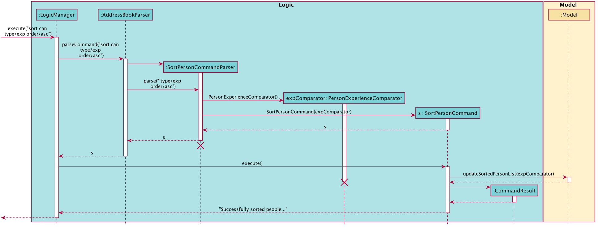
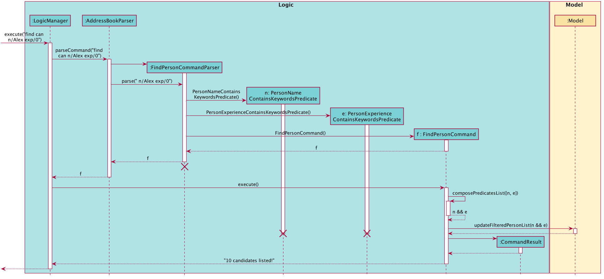

CANdidates is an open source, brownfield project on the existing [Address book
 Level-3](https://se-education.org/addressbook-level3/). If you are ready to
 contribute to this [project](https://github.com/AY2021S1-CS2103T-T17-3/tp),
 create a pull request [here](https://github.com/AY2021S1-CS2103T-T17-3/tp/pulls).

* Table of Contents
{:toc}

--------------------------------------------------------------------------------------------------------------------

## **1. Setting up, getting started**

Refer to the guide [_Setting up and getting started_](SettingUp.md).

--------------------------------------------------------------------------------------------------------------------

## **2. Design**

### 2.1 Architecture

The ***Architecture Diagram*** given above explains the high-level design of the App. Given below is a quick overview of each component.

:bulb: **Tip:** The `.puml` files used to create diagrams in this document can be found in the [diagrams](https://github.com/se-edu/addressbook-level3/tree/master/docs/diagrams/) folder. Refer to the [_PlantUML Tutorial_ at se-edu/guides](https://se-education.org/guides/tutorials/plantUml.html) to learn how to create and edit diagrams.

**`Main`** has two classes called [`Main`](https://github.com/se-edu/addressbook-level3/tree/master/src/main/java/seedu/address/Main.java) and [`MainApp`](https://github.com/se-edu/addressbook-level3/tree/master/src/main/java/seedu/address/MainApp.java). It is responsible for,
* At app launch: Initializes the components in the correct sequence, and connects them up with each other.
* At shut down: Shuts down the components and invokes cleanup methods where necessary.

[**`Commons`**](#common-classes) represents a collection of classes used by multiple other components.

The rest of the App consists of four components.

* [**`UI`**](#ui-component): The UI of the App.
* [**`Logic`**](#logic-component): The command executor.
* [**`Model`**](#model-component): Holds the data of the App in memory.
* [**`Storage`**](#storage-component): Reads data from, and writes data to, the hard disk.

Each of the four components,

* defines its *API* in an `interface` with the same name as the Component.
* exposes its functionality using a concrete `{Component Name}Manager` class (which implements the corresponding API `interface` mentioned in the previous point.

For example, the `Logic` component (see the class diagram given below) defines its API in the `Logic.java` interface and exposes its functionality using the `LogicManager.java` class which implements the `Logic` interface.

**How the architecture components interact with each other**

The *Sequence Diagram* below shows how the components interact with each other for the scenario where the user issues the command `delete can 1`.

The sections below give more details of each component.

### 2.2 UI component

**API** :
[`Ui.java`](https://github.com/se-edu/addressbook-level3/tree/master/src/main/java/seedu/address/ui/Ui.java)

The UI consists of a `MainWindow` that is made up of parts e.g.`CommandBox`, `ResultDisplay`, `PersonListPanel`, `JobListPanel`, `PersonDetailedView`, `JobDetailedView` etc. All these, including the `MainWindow`, inherit from the abstract `UiPart` class.

The `UI` component uses JavaFx UI framework. The layout of these UI parts are defined in matching `.fxml` files that are in the `src/main/resources/view` folder. For example, the layout of the [`MainWindow`](https://github.com/se-edu/addressbook-level3/tree/master/src/main/java/seedu/address/ui/MainWindow.java) is specified in [`MainWindow.fxml`](https://github.com/se-edu/addressbook-level3/tree/master/src/main/resources/view/MainWindow.fxml)

The `UI` component,

* Executes user commands using the `Logic` component.
* Listens for changes to `Model` data so that the UI can be updated with the modified data.
* Responds to events raised by various commands which may result in changed to the UI.

### 2.3 Logic component

**API** :
[`Logic.java`](https://github.com/se-edu/addressbook-level3/tree/master/src/main/java/seedu/address/logic/Logic.java)

1. `Logic` uses the `AddressBookParser` class to parse the user command.
1. This results in a `Command` object which is executed by the `LogicManager`.
1. The command execution can affect the `Model` (e.g. adding a candidate).
1. The result of the command execution is encapsulated as a `CommandResult` object which is passed back to the `Ui`.
1. In addition, the `CommandResult` object can also instruct the `Ui` to perform certain actions, such as displaying help to the user.

Given below is the Sequence Diagram for interactions within the `Logic` component for the `execute("delete can 1")` API call.

:information_source: **Note:** The lifeline for `DeletePersonCommandParser` should end at the destroy marker (X) but due to a limitation of PlantUML, the lifeline reaches the end of diagram.

### 2.4 Model component

**API** : [`Model.java`](https://github.com/se-edu/addressbook-level3/tree/master/src/main/java/seedu/address/model/Model.java)

The `Model`,

* stores a `UserPref` object that represents the user’s preferences.
* stores the address book data.
* exposes an unmodifiable `ObservableList<Person>` and an unmodifiable `ObservableList<Job>` that can be 'observed' e.g. the UI can be bound to these lists so that the UI automatically updates when the data in the lists change.
* does not depend on any of the other three components.  

:information_source: **Note:** The Model class diagram shown above omits certain details due to space constraints, namely the classes in the Information Package 
                                                                             that Person and Job hold reference to. Instead, the omitted details have been extracted and are shown here:  

 

### 2.5 Storage component

**API** : [`Storage.java`](https://github.com/se-edu/addressbook-level3/tree/master/src/main/java/seedu/address/storage/Storage.java)

The `Storage` component,
* Implements both `PersonAddressBookStorage` and `JobAddressBookStorage`
* can save `UserPref` objects in json format and read it back.
* can save `PersonAddressBook` data and `JobAddressBook` data in json format and read it back.
* `JsonPersonAddressBookStorage` and `JsonJobAddressBookStorage` is reponsible for saving the datas in json format.

### 2.6 Common classes

Classes used by multiple components are in the `seedu.addressbook.commons` package.

--------------------------------------------------------------------------------------------------------------------

## **3. Implementation**

This section describes some noteworthy details on how certain features are implemented.

### 3.1 Add feature

The Add feature has two variants, one for adding candidates `add can` and one for adding jobs `add job`. We will illustrate this feature using only the candidates variant here
as the job variant works analogously.

The implemented add mechanism is facilitated by `ModelManager`. They both implement `Model` and contain `FilteredList` of filtered `Person`. `FilteredList` is a subclass of `ObservableList`.

Additionally, it implements the following operations:

* `ModelManager#hasPerson(Person person)` —  Check whether the same person exist in the FilteredList of persons using the `equals` method of `Persons`.

* `ModelManager#addPerson(Person person)` —  Adds the person into the FilteredList of persons.

Given below is an example usage scenario and how the `add can` mechanism behaves at each step. 

Step 1. The user launches the application for the first time. The `FilteredList` will be initialised with the `UniquePersonList` from `personAddressBook` which contains a list of candidates.

Step 2. The user executes `add can n/John p/98765432 e/john@ex.com a/John street exp/5 doa/15-10-20` to add a candidate with `Name` John, `Phone` 98765432, `Email` john@ex.com, `Address` John street, `Experience` 5 and `Date` 15-10-20.

Step 3. The method `AddressBookParser#parseCommand` is invoked to determine the command type. Since this is an `add can` command, the `AddPersonCommandParser#parse` is then called to parse the arguments. If the input command has an invalid format, `AddPersonCommandParser` throws a `ParseException`, if not, a `AddPersonCommand` object is created.

Step 4. `ModelManager#hasJob(Person person)` is invoked to check whether the same person exist in the FilteredList of persons using the `equals` method of `Person`. If a duplicate person exists, a `CommandException` is thrown. Otherwise, the method `ModelManager#addPerson(Person person)` is invoked to add the person into the FilteredList of persons.

Step 5. The `savePersonAddressBook` method of `StorageManager`, which is a subclass of `Storage`, is invoked to update the new person addition in the `personAddressBook` and saved. 

The following sequence diagram shows how the `add can` operation works in the scenario described above:

:information_source: **Note:** The usage scenario and sequence diagram for the analogous `add job` operation are mostly similar, using its `AddJobCommandParser`, `AddJobCommand`, `hasJob`, `addJob`, `saveJobAddressBook` and `JobAddressBook` counterparts.

### 3.2 Edit feature

The Edit feature has two variants, one for editing candidates `edit can` and one for editing jobs `edit job`. We will illustrate this feature using only the candidates variant here
as the job variant works analogously. 

The implemented edit mechanism is facilitated by `ModelManager`.  It implements `Model` and contains a `FilteredList`, which is a subclass of `ObservableList`. 
Additionally, it implements the following operations:

* `ModelManager#setPerson(Person target, Person editedPerson)` —  Replaces the Person target  with editedPerson.

* `ModelManager#updateFilteredPersonList(Predicate<Person> predicate)` —  Updates the FilteredList of persons using the supplied predicate.

Given below is an example usage scenario and how the edit mechanism behaves at each step.

Step 1. The user launches the application for the first time. The `FilteredList` will be initialised with the `UniquePersonList` from `personAddressBook` which contains a list of candidates.

Step 2. The user executes `edit can 2 n/Rob Mi` to change the `Name` of the candidate at `Index` 2 to Rob Mi. 

Step 3. The method `AddressBookParser#parseCommand` is invoked to distinguish which type of command it is. After discerning it is an `edit can` command,
the `EditPersonCommandParser#parse` is then invoked to parse the arguments.
If the command format is invalid, `EditPersonCommandParser` throws an error.

Step 4. A `EditPersonDescriptor` object, which is an inner class of `EditPersonCommand`, is created from parsing the command and is used
to store the details to edit the candidate with. In this case, it stores the `Name` Rob Mi.

Step 5. A `EditPersonCommand` object is also created from parsing the comamand. In the `EditPersonCommand#execute` method, 
if the candidate `Index` provided by the user is invalid, an error is thrown. 
Otherwise, the method `ModelManager#setPerson()` is invoked to replace the old candidate with the newly edited candidate. 
 Then, `ModelManager#updateFilteredPersonList()` is invoked and the `FilteredList` and `personAddressBook` is updated and saved.

The following sequence diagram shows how the edit operation works in the scenario described above:

:information_source: **Note:** The usage scenario and sequence diagram for the analogous `edit job` operation are mostly similar, using its `EditJobDescriptor`, `EditJobCommand`, `EditJobCommandParser`, `UniqueJobList` and `JobAddressBook` counterparts.

### 3.3 List feature

The List feature has two variants, one for listing candidates `list can` and one for listing jobs `list job`. We will illustrate this feature using only the candidates variant here
as the job variant works analogously.

The implemented list mechanism is facilitated by `ModelManager`. It implements `Model` and contains a `FilteredList`, which is a subclass of `ObservableList`.
Additionally, it implements the following operations:

* `ModelManager#updateFilteredPersonList(Predicate<Person> predicate)` —  Updates the FilteredList of candidates using the supplied predicate.

Given below is an example usage scenario and how the list mechanism behaves at each step.

Step 1. The user launches the application for the first time. The `FilteredList` will be initialised with the `UniquePersonList` from `personAddressBook` which contains a list of candidates.

Step 2. The user executes `list can` to list all candidates.

Step 3. A `ListPersonCommand` object is created from parsing the command. In the `ListPersonCommand#execute` the method `ModelManager#updateFilteredPersonList(PREDICATE_SHOW_ALL_PERSONS)` is invoked 
and the `FilteredList` shows all candidates in the list as indicated by the given predicate.

The following sequence diagram shows how the list operation works in the scenario described above:

:information_source: **Note:** The usage scenario and sequence diagram for the analogous `list can` operation are mostly similar, using its `ListCanCommand`, `UniquePersonList` and `PersonAddressBook` counterpart.

### 3.4 Sort feature

The Sort feature has two variants, one for sorting candidates `sort can` and one for sorting jobs `sort job`. We will illustrate this feature using only the candidates variant here
as the job variant works analogously.

The implemented sort mechanism is facilitated by `ModelManager`. It implements `Model` and contains a `SortedList`, which is a subclass of `ObservableList`.
Additionally, it implements the following operations:

* `ModelManager#updateSortedPersonList(Comparator<Person> comp)` —  Sorts the current SortedList of persons using the supplied comparator.

Given below is an example usage scenario and how the sort mechanism behaves at each step.

Step 1. The user launches the application for the first time. The `SortedList` will be initialised with the `UniquePersonList` from `personAddressBook` which contains a list of candidates.

Step 2. The user executes `sort can type/exp order/asc` to sort the candidates by their `Experience` in ascending order. If the `type` of comparator field i.e. `exp` or the `order` i.e. `asc` is missing, `SortPersonCommandParser` throws an error message.

Step 3. A `PersonExperienceComparator` is created from parsing the command and a `SortPersonCommand` object is created. In the `SortPersonCommand#execute` the method `ModelManager#updateSortedPersonList(PersonExperienceComparator)` is invoked and the `SortedList` is sorted using the `PersonExperienceComparator`. The `UniquePersonList` in `personAddressBook` is then set to be the `SortedList`.

:information_source: **Note:** The usage scenario and sequence diagram for the analogous `sort job` operation are mostly similar, using its `SortJobCommand` ,`SortJobCommandParser`, `UniqueJobList` and `JobAddressBook` counterparts.

### 3.5 Find feature

The Find feature has two variants, one for finding candidates `find can` and one for finding jobs `find job`. We will illustrate this feature using only the candidates variant here
as the job variant works analogously.

The implemented find mechanism is facilitated by `ModelManager`. It implements `Model` and contains a `FilteredList`, which is a subclass of `ObservableList`.
Additionally, it implements the following operations:

* `ModelManager#updateFilteredPersonList(Predicate<Person> predicate)` —  Updates the FilteredList of persons using the supplied predicate.

Given below is an example usage scenario and how the find mechanism behaves at each step.

Step 1. The user launches the application for the first time. The `FilteredList` will be initialised with the `UniquePersonList` from `personAddressBook` which contains a list of candidates.

Step 2. The user executes `find can n/Alex exp/0` to find candidates with the `Name` Alex and `Experience` 5.

Step 3. A `PersonNameContainsKeywordsPredicate` and `PersonExperienceContainsKeywordsPredicate` which are subclasses of `Predicate` are created from parsing the command and a `FindPersonCommand` object is created.

Step 4. In the `FindPersonCommand#execute`, the method `composePredicatesList(List<Predicate<Person>> predicates)` is invoked to produce a `Predicate<Person>` that represents a short-circuiting logical AND of all predicates in the list.
`ModelManager#updateFilteredPersonList(Predicate<Person>)` is invoked and the `FilteredList` is filtered using the `Predicate<Person>` returned by the method `composePredicatesList`.

The following sequence diagram shows how the find operation works in the scenario described above:

:information_source: **Note:** The usage scenario and sequence diagram for the analogous `find job` operation are mostly similar, using its `FindJobCommand`, `FindJobCommandParser`, `UniqueJobList` and `JobAddressBook` counterparts.

The above only demonstrates finding candidates by their `Name` and `Experience`.
The find operation also supports finding candidates via other fields such as `Email` and `Vacancy`.

### 3.6 View feature

The Edit feature has two variants, one for adding candidates `add can` and one for adding jobs `add job`. We will illustrate this feature using only the candidates variant here
as the job variant works analogously.

The implemented view feature has two variants `view can` and `view job` for viewing a candidate and viewing a job respectively.

The mechanism for both view features are faciliated by `ModelManager` and `MainWindow`. `ModelManager` implements model and contains a `displayedPerson` which is of type `Person` and a `displayedJob` which is of type `Job`.

 `ModelManager` implements the following operations:

* `ModelManager#setDisplayedPerson(Person person)` — Sets the `displayedPerson` in the `ModelManager` class to be the supplied person.
* `ModelManager#setDisplayedJob(Job job)` — Sets the `displayedJob` in the `ModelManager` class to be the supplied job.

`MainWindow` implements the following operations:

* `MainWindow#updateDetailedPersonPanel(Person person)` — Updates the view on the right panel of the GUI to contain information of the supplied person.
* `MainWindow#updateDetailedJobPanel(Job job)` — Updates the view on the right panel of the GUI to contain information of the supplied job.

Given below is an example usage scenario and how the `view can` mechanism behaves at each step.

Step 1. The user launches the application for the first time. The `displayedPerson` will be initialised with `null`.

Step 2. The user executes `view can 1` to show the candidate at `Index` 1 on the right panel of the GUI.

Step 3. The method `AddressBookParser#parseCommand` is invoked to distinguish which type of command it is. After discerning it is an `view can` command, the `ViewPersonCommandParser#parse` is then invoked to parse the arguments. If the command format is invalid, `ViewPersonCommandParser` throws an error.

Step 4. A `ViewPersonCommand` object is created from parsing the argument.

Step 5. In the `ViewPersonCommand#execute` method, the `ModelManager#getFilteredPersonList()` is invoked to obtain a `displayablePersons` which is a list of the candidates in the address book. The supplied `Index` is then used to obtain the `Person` in `displayablePerson` to be displayed. The method `ModelManager#setDisplayedPerson(Person person)` is invoked to set the person to be displayed to be the `Person` obtained from `displayablePersons`.

Step 6. A `CommandResult` object is created from `ViewPersonCommand#execute`. The method `MainWindow#updateDetailedPersonPanel(Person person)` is also invoked from the execution of the command.

Step 7. Candidate at `Index` 1 is now displayed on the right panel.

The following sequence diagram shows how the view operation works in the scenario described above:

:information_source: **Note:** The usage scenario and sequence diagram for the analogous `view job` operation are mostly similar, using its `ViewJobCommand`, `ViewJobCommandParser`, `displayableJobs` and `displayedJob` counterparts.

## **4. Proposed Features**

### 4.1 Undo/redo feature

#### 4.1.1 Proposed Implementation

The proposed undo/redo mechanism is facilitated by `VersionedPersonAddressBook`. It extends `PersonAddressBook` and `VersionedJobAddressBook` respectively with an undo/redo history, stored internally as an `personAddressBookStateList` and `currentStatePointer`. Additionally, it implements the following operations:

* `VersionedPersonAddressBook#commit()` — Saves the current person address book state in its history.
* `VersionedPersonAddressBook#undo()` — Restores the previous person address book state from its history.
* `VersionedPersonAddressBook#redo()` — Restores a previously undone person address book state from its history.

These operations are exposed in the `Model` interface as `Model#commitPersonAddressBook()`, `Model#undoPersonAddressBook()` and `Model#redoPersonAddressBook()` respectively.

Given below is an example usage scenario and how the undo/redo mechanism behaves at each step.

Step 1. The user launches the application for the first time. The `VersionedPersonAddressBook` will be initialized with the initial person address book state, and the `currentStatePointer` pointing to that single person address book state.

Step 2. The user executes `delete can 5` command to delete the 5th person in the address book. The `delete can` command calls `Model#commitPersonAddressBook()`, causing the modified state of the person address book after the `delete can 5` command executes to be saved in the `personAddressBookStateList`, and the `currentStatePointer` is shifted to the newly inserted person address book state.

Step 3. The user executes `add can n/David …​` to add a new person. The `add can` command also calls `Model#commitPersonAddressBook()`, causing another modified address book state to be saved into the `addressPersonBookStateList`.

:information_source: **Note:** If a command fails its execution, it will not call `Model#commitPersonAddressBook()`, so the address book state will not be saved into the `personAddressBookStateList`.

Step 4. The user now decides that adding the person was a mistake, and decides to undo that action by executing the `undo can` command. The `undo can` command will call `Model#undoPersonAddressBook()`, which will shift the `currentStatePointer` once to the left, pointing it to the previous person address book state, and restores the address book to that state.

:information_source: **Note:** If the `currentStatePointer` is at index 0, pointing to the initial PersonAddressBook state, then there are no previous PersonAddressBook states to restore. The `undo can` command uses `Model#canUndoPersonAddressBook()` to check if this is the case. If so, it will return an error to the user rather
than attempting to perform the undo.

The following sequence diagram shows how the `undo can` operation works:

:information_source: **Note:** The lifeline for `UndoPersonCommand` should end at the destroy marker (X) but due to a limitation of PlantUML, the lifeline reaches the end of diagram.

The `redo can` command does the opposite — it calls `Model#redoPersonAddressBook()`, which shifts the `currentStatePointer` once to the right, pointing to the previously undone state, and restores the person address book to that state.

:information_source: **Note:** If the `currentStatePointer` is at index `personAddressBookStateList.size() - 1`, pointing to the latest person address book state, then there are no undone PersonAddressBook states to restore. The `redo can` command uses `Model#canRedoPersonAddressBook()` to check if this is the case. If so, it will return an error to the user rather than attempting to perform the redo.

Step 5. The user then decides to execute the command `list can`. Commands that do not modify the address book, such as `list can` and `help`, will usually not call `Model#commitPersonAddressBook()`, `Model#undoPersonAddressBook()` or `Model#redoPersonAddressBook()`. Thus, the `personAddressBookStateList` remains unchanged.

Step 6. The user executes `clear can`, which calls `Model#commitPersonAddressBook()`. Since the `currentStatePointer` is not pointing at the end of the `personAddressBookStateList`, all address book states after the `currentStatePointer` will be purged. Reason: It no longer makes sense to redo the `add can n/David …​` command. This is the behavior that most modern desktop applications follow.

The following activity diagram summarizes what happens when a user executes a new command:

:information_source: **Note:** The analogous `redo job` and `undo job` features can be implemented in the same way, using its `VersionedJobAddressBook`, `JobAddressBook` and `jobAddressBookStateList` counterparts.

#### 4.1.2 Design consideration

##### 4.1.2.1 Aspect: How undo & redo executes

* **Alternative 1 (current choice):** Saves the entire address book.
  * Pros: Easy to implement.
  * Cons: May have performance issues in terms of memory usage.

* **Alternative 2:** Individual command knows how to undo/redo by
  itself.
  * Pros: Will use less memory (e.g. for `delete can`, just save the person being deleted).
  * Cons: We must ensure that the implementation of each individual command are correct.

--------------------------------------------------------------------------------------------------------------------

## **5. Documentation, logging, testing, configuration, dev-ops**

* [Documentation guide](Documentation.md)
* [Testing guide](Testing.md)
* [Logging guide](Logging.md)
* [Configuration guide](Configuration.md)
* [DevOps guide](DevOps.md)

--------------------------------------------------------------------------------------------------------------------

## **6. Appendix: Requirements**

### 6.1 Product scope

**Target user profile**: Job Recruiter

* Has a need to manage a significant number of contacts, specifically job listings and candidates applying for jobs
* Has a need to store relevant additional information of job listing and candidates applying for jobs other than contact details
* Prefer desktop apps over other types
* Can type fast
* Prefers typing to mouse interactions
* Is reasonably comfortable using CLI apps

**Value proposition**: 

* Manage contacts faster than a typical mouse/GUI driven app. 
* Convenient access to contact details of job candidates as well as job openings on one centralised platform.
* Store additional information for job openings such as priority and number of vacancies.
* Store additional information for job candidates such as years of experience and expected salary.
* Search for job candidates and job openings by various fields.
* Sort job candidates and job openings by various fields.

### 6.2 User stories

Priorities: High (must have) - `* * *`, Medium (nice to have) - `* *`, Low (unlikely to have) - `*`

| Priority | As a …​                                 | I want to …​                                                                       | So that I can…​                                                                         |
| -------- | ------------------------------------------ | ------------------------------------------------------------------------------------- | ------------------------------------------------------------------------------------------ |
| `* * *`  | job recruiter                              | have a platform to consolidate all _information_ of candidates                        |  avoid receiving applications from the same people repeatedly                              |
| `* * *`  | job recruiter                              | have a way to filter candidates by the type of job they are applying for              |                                                                                            |
| `* * *`  | job recruiter                              | have a way to be able to delete candidates when they are successfully hired           | optimise my search                                                                         |
| `* * *`  | job recruiter                              | have a way to keep track of duplicate candidates                                      | avoid adding the same candidate multiple times                                             |
| `* * *`  | job recruiter                              | keep the links to candidates' resumes (GitHub, LinkedIn, etc.)                        | review them conveniently                                                                   |
| `* * *`  | job recruiter                              | be able to delete job listings when they are filled up                                |                                                                                            |
| `* * *`  | job recruiter                              | be able to filter jobs by their vacancies                                             |                                                                                            |
| `* * *`  | job recruiter                              | be able to tag jobs with different priorities                                         |                                                                                            |
| `* * *`  | job recruiter                              | be able to filter jobs by their priorities                                            |                                                                                            |
| `* * *`  | careless job recruiter                     | have a way to edit the contacts                                                       | rectify wrong entries                                                                      |
| `* *`    | new user exploring the application         | see sample data stored in the App                                                     | see how the App would work when it is in use                                               |
| `* *`    | technology inept person                    | have an App that is intuitive to use                                                  |                                                                                            |
| `* *`    | aesthetic individual                       | have an App that is clean and aesthetically pleasing                                  |                                                                                            |
| `* *`    | job recruiter                              | have a way to filter candidates by the date they applied for the job                  |                                                                                            |
| `* *`    | job recruiter                              | have a way to filter candidates by their years of experience                          |                                                                                            |
| `* *`    | job recruiter                              | have a way to blacklist candidates that do not respond or have poor attitudes         | take note to not consider them again in the future                                         |
| `* *`    | job recruiter                              | have a way to organise my contact information easily                                  |                                                                                            |
| `* *`    | job recruiter                              | have a way to sort candidates based on their expected salary                          |                                                                                            |
| `* *`    | job recruiter                              | be brought directly to the relevant pages to view the candidates’ further information |                                                                                            |
| `* *`    | job recruiter                              | be able to view the ranking of the candidates based on various _criteria_             | provide a list of candidates that best fulfil the recruitment criteria(s) to the companies |
| `* *`    | job recruiter                              | be notified of duplicate job listings when adding a new entry to the list             |                                                                                            |
| `* *`    | efficient job recruiter                    | be able to effectively search for candidates whenever there is a new job opening      | answer to hiring companies quickly                                                         |
| `* *`    | veteran job recruiter                      | be able to store as many contacts as possible without lagging the software            |                                                                                            |
| `* *`    | user that is ready to start using the app  | have an easy way to clear all the sample data                                         | fill in my data                                                                            |
| `*`      | job recruiter                              | have a way to keep track of interview schedules                                       |                                                                                            |
| `*`      | single person                              | have a way to store the contacts of cute job applicants                               |                                                                                            |
| `*`      | long term user of the App                  | have a way to archive some of the unused data                                         | prevent cluttering                                                                         |
| `*`      | efficient person                           | be able to perform mass operations like deleting multiple entries at once             |                                                                                            |
| `*`      | job recruiter                              | have a way to filter job applicants by their gender                                   |                                                                                            |

### 6.3 Use cases

(For all use cases below, the **System** is the `CANdidates` and the **Actor** is the `user`, unless specified otherwise)
      

#### 6.3.1 Use case: UC01 - Add a candidate

**MSS**

1.  User adds a candidate
2.  CANdidates shows a list of candidates, containing the newly added candidate

    Use case ends.

**Extensions**

* 1a. Input format is invalid.

    * 1a1. CANdidates shows an error message.

      Use case ends.

* 1b. The given candidate already exists.

    * 1b1. CANdidates shows an error message.

      Use case ends.

#### 6.3.2 Use case: UC02 - List candidates

**MSS**

1.  User requests to list candidates
2.  CANdidates shows a list of candidates

    Use case ends.

**Extensions**

* 1a. Input format is invalid.

    * 1a1. CANdidates shows an error message.

      Use case ends.

#### 6.3.3 Use case: UC03 - Delete a candidate

**MSS**

1.  User requests to _list candidates (UC01)_
2.  User requests to delete a specific candidate index in the list
3.  CANdidates deletes the candidate

    Use case ends.

**Extensions**

* 1a. The list is empty.

  Use case ends.

* 2a. The given index is invalid.

    * 2a1. CANdidates shows an error message.

      Use case ends.

#### 6.3.4 Use case: UC04 - Edit a candidate

**MSS**

1.  User requests to _list candidates (UC01)_
2.  User requests to edit the details of a specific candidate index in the list
3.  CANdidates edits the candidate

    Use case ends.

**Extensions**

* 1a. The list is empty.

  Use case ends.
  
* 2a. The given index is invalid.

    * 2a1. CANdidates shows an error message.

      Use case ends.

* 2b. The format of the given details are invalid.

    * 2b1. CANdidates shows an error message.

      Use case ends.

#### 6.3.5 Use case: UC05 - Clear all candidates

**MSS**

1.  User requests to _list candidates (UC01)_
2.  User requests to clear all candidates in the list
3.  CANdidates clears the list

    Use case ends.

**Extensions**

* 1a. The list is empty.

  Use case ends.

#### 6.3.6 Use case: UC06 - Find candidates

**MSS**

1.  User requests to find candidates with keywords
2.  CANdidates shows a list of candidates matching keywords

    Use case ends.

**Extensions**

* 1a. Input format is invalid.

    * 1a1. CANdidates shows an error message.

      Use case ends.

#### 6.3.7 Use case: UC07 - Sort candidates

**MSS**

1.  User requests to _list candidates (UC01)_
2.  User requests to sort the list in an order based on a field type
3.  CANdidates displays the list of candidates in the specified order

    Use case ends.

**Extensions**

* 1a. The list is empty.

  Use case ends.
  
* 2a. The given field type is invalid.

    * 2a1. CANdidates shows an error message.

      Use case ends.

* 2b. The given order is invalid.

    * 2b1. CANdidates shows an error message.

      Use case ends.
    
#### 6.3.8 Use case: UC08 - View a Candidate

**MSS**

1. User requests to view a candidate.
2. CANdidates displays the information of a candidate on the right panel.
    
    Use case ends.
    
**Extensions**

* 1a. The list is empty.

    Use case ends.

* 2a. The given index is invalid.
    
    * 2a1. CANdidates shows an error message.
    
    Use case ends.
    
#### 6.3.9 Use case: UC08 - Add a job

Similar to UC01, except user will request to add a job instead.

#### 6.3.10 Use case: UC09 - List jobs

Similar to UC02, except user will request to list jobs and CANdidates will show a list of jobs instead.

#### 6.3.11 Use case: UC10 - Delete a job

Similar to UC03, except user will request to delete a specific job index.

#### 6.3.12 Use case: UC11 - Edit a candidate

Similar to UC04, except user will request to edit details of a specific job index.

#### 6.3.13 Use case: UC12 - Clear all jobs

Similar to UC05, except user will request to clear all jobs.

#### 6.3.14 Use case: UC13 - Find jobs

Similar to UC06, except user will request to find jobs with keywords and CANdidates will show a list of jobs instead.

#### 6.3.15 Use case: UC14 - Sort jobs

Similar to UC07, except user will request to sort jobs.

#### 6.3.16 Use case: UC14 - View a job

Similar to UC08, except user will request to view a job and CANdidates will display information of the job on the right panel instead.

#### 6.3.17 Use case: UC15 - Requesting for help

**MSS**

1.  User requests for help
2.  CANdidates displays help window with link to User Guide
3.  User copies the link and closes the window

    Use case ends.

### 6.4 Non-Functional Requirements

1.  Should work on any _mainstream OS_ as long as it has Java `11` or above installed.
1.  Should be able to hold up to 1000 persons without a noticeable sluggishness in performance for typical usage.
1.  A user with above average typing speed for regular English text (i.e. not code, not system admin commands)
 should be able to accomplish most of the tasks faster using commands than using the mouse.
1.  Should be a single user product.
1.  The data should be stored locally in a human editable text file.
1.  Should work without requiring an installer.
1.  Should not include _hard-to-test features_.
1.  The project is expected to adhere to a schedule that delivers a feature set every one to two weeks.
1.  Should have an intuitive interface for new users to pick up the application easily.
1.  Should be able to work without an internet connection.
1.  Any reused code should be used with appropriate credit given.
1.  Should not include copyrighted audio or graphics.

### 6.5 Glossary

* **Information**: Name, phone number, address, job type etc.
* **Criteria**: Work experience, language and other skills.
* **Mainstream OS**: Windows, Linux, Unix, OS-X
* **Hard-to-test features**: Features that heavily depend on remote APIs, audio-related features,
as well as features requiring creation of user accounts etc.
--------------------------------------------------------------------------------------------------------------------

## **7. Appendix: Instructions for manual testing**

Given below are instructions to test the app manually.

:information_source: **Note:** These instructions only provide a starting point for testers to work on;
testers are expected to do more *exploratory* testing.

### 7.1 Launch and shutdown

1. Initial launch

   1. Download the jar file and copy into an empty folder

   1. Double-click the jar file  
   Expected: Shows the GUI with a set of sample contacts. The window size should be fixed and non-adjustable.

1. Exiting the application

   1. Type `Exit` in the command box and press *Enter*.  
   Expected: The application closes. The json files `personaddressbook.json` and `jobaddressbook.json` are updated accordingly.
   
1. Subsequent launch

   1. Double-click the jar file  
   Expected: Shows the GUI with contacts loaded from the json data files. The window size should be fixed and non-adjustable.
   
### 7.2 Adding a candidate

1. Adding a candidate while on the candidates tab and all candidates are displayed 

    1. Prerequisites: List all candidates on the candidates tab using the `list can` command.
    
    1. Test case (specifying only compulsory input fields): `add can n/Rob p/88888888 e/e@mail.com doa/01-02-20 exp/5.5` 
       Expected: A new candidate is added at the end of the candidates list. 
       Details of the added candidate shown in the status message. The compulsory input fields are set to the values specified in the command. 
       The optional `Address`, `Salary`, `Link` and `Tag` fields are empty. The optional `Blacklisted` field is set to false by default.
       
    1. Test case (missing a compulsory input field): `add can n/Rob p/88888888 e/e@mail.com doa/01-02-20` 
       Expected: No new candidate is added. Invalid command format error shown in the status message due to the command
       missing the compulsory `exp/YEARS_OF_EXPERIENCE` input field.
       
    1. Other incorrect add commands to try include omitting other compulsory fields.  
       Expected: Similar to previous  
     
### 7.3 Adding a job

1. Adding a job while on the job listings tab and all jobs are displayed 

    1. Prerequisites: List all jobs on the job listings tab using the `list job` command.
    
    1. Test case (specifying only compulsory input fields): `add job n/Delivery Man c/FedEx e/fedex@example.com a/Joo Koon p/93333222` 
       Expected: A new job is added at the end of the job listings list.  
       Details of the added job shown in the status message. The compulsory input fields are set to the values specified in the command. 
       The optional `Tag` field is empty. The optional `Priority` field is set to moderate by default.
       
    1. Test case (missing a compulsory input field): `add job n/Delivery Man c/FedEx e/fedex@example.com a/Joo Koon` 
       Expected: No new job is added. Invalid command format error shown in the status message due to the command
       missing the compulsory `p/PHONE_NUMBER` input field.
       
    1. Other incorrect add jobs to try include omitting other compulsory fields.  
       Expected: Similar to previous  
        
### 7.4 Listing all candidates

1. Listing all candidates while on the job listings tab. 

    1. Prerequisites: At least one candidate added to the list. Perform test case 1.2 from [Section 7.2. Adding a candidate](#72-adding-a-candidate) to add a new candidate and verify that it passes.   
 
    1. Test case: `list can` 
       Expected: The application automatically changes to the candidates tab, and displays all candidates. 
        

:information_source: **Note:** Listing jobs can be tested in the same way but with its analogous commands while on the candidates tab.
   

        
### 7.5 Editing a candidate

1. Editing a candidate while on the candidates tab and all candidates are displayed 

    1. Prerequisites: Perform test case 1.2 from [Section 7.2. Adding a candidate](#72-adding-a-candidate) to add a new candidate and verify that it passes.
    
    1. Test case: `edit can INDEX n/Ron bl/true` where `INDEX` is the list index of the candidate just added in the prerequisite step  
       Expected: The `Name` of the candidate at index `INDEX` changes from _Rob_ to _Ron_ and `Blacklisted` changes from _false_ to _true_.
       No other input fields are changed (rest of the fields remain same). Details of the edited candidate shown in the status message.
       
    1. Test case: `edit can INDEX` where `INDEX` is the list index of the candidate just added in the prerequisite step  
       Expected: No candidate edited. No fields provided error shown in the status message.

   
:information_source: **Note:** Editing jobs can be tested in the same way but with its analogous commands and input fields.
   

       
    
### 7.6 Detecting duplicate candidates

1. Detecting and preventing the creation of duplicate candidates
     
   1. Prerequisites: Perform test case 1.2 from [Section 7.2. Adding a candidate](#72-adding-a-candidate) to add a new candidate and verify that it passes. 
   
   1. Test case (Same name and phone): `add can n/Rob p/88888888 e/mail@gmail.com doa/08-10-22 exp/15`  
      Expected: No new candidate added. Duplicate candidate error shown in the status message.
      
   1. Test case (Same name and email): `add can n/Rob p/12345 e/e@mail.com doa/08-10-22 exp/15`  
      Expected: No new candidate added. Duplicate candidate error shown in the status message.    

### 7.7 Detecting duplicate jobs

1. Detecting and preventing the creation of duplicate jobs
     
   1. Prerequisites: Perform test case 1.2 from [Section 7.3. Adding a job](#73-adding-a-job) to add a new job and verify that it passes. 
   
   1. Test case (Same job title and company name): `add job n/Delivery Man c/FedEx e/anotherfedex@example.com a/Jurong West p/84378293`  
      Expected: No new job listing added. Duplicate job error shown in the status message.
      
### 7.8 Deleting a candidate

1. Deleting a candidate while on the candidates tab and all candidates are displayed

   1. Prerequisites: List all candidates on the candidates tab using the `list can` command. Multiple candidates in the candidates list.

   1. Test case: `delete can 1` 
      Expected: First candidate contact is deleted from the candidates list. Details of the deleted candidate shown in the status message.

   1. Test case: `delete can 0` 
      Expected: No candidate is deleted. Invalid candidate index error shown in the status message.

   1. Other incorrect delete commands to try: `delete can`, `delete can -1`, `delete can x` (where x is larger than the list size) 
      Expected: Similar to previous.

2. Deleting a candidate while on the job listings tab
    
    1. Prerequisites: Switch to the job listings tab using the `list job` command. Multiple candidates in the candidates list.
    
    1. Test case:  `delete can 1` 
       Expected:  The tab switches from the job listings tab to the candidates tab automatically. First candidate contact is deleted 
       from the candidates list. Details of the deleted candidate shown in the status message.
     
    1. Test case:  `delete can 0` 
       Expected: The tab does not switch to the candidates tab. No candidate is deleted. Invalid candidate index error shown in the status message. 
       
    1. Other incorrect delete commands to try: `delete can`, `delete can -1`, `delete can x` (where x is larger than the list size) 
       Expected: Similar to previous.  
       

:information_source: **Note:** Deleting jobs can be tested in the same way but with its analogous commands.

       
### 7.9 Clearing all candidates

1. Clearing all candidates while on the candidates tab and all candidates are displayed

    1. Prerequisites: List all candidates on the candidates tab using the `list can` command. Multiple candidates in the candidates list.
    
    1. Test case: `clear can` 
       Expected: All candidate contacts are deleted from the candidate list. Clear candidate success message shown in the status message. 
       
    1. Test case: `clear` 
       Expected: No candidates or jobs are deleted. Unknown command error shown in the status message.
       
2. Clearing all candidates while on the job listings tab

    1. Prerequisites: Switch to the job listings tab using the `list job` command. Multiple candidates in the candidates list.
    
    1. Test case:  `clear can` 
       Expected:  The tab switches from the job listings tab to the candidates tab automatically.  
       All candidate contacts are deleted from the candidate list. Clear candidate success message shown in the status message.
              
    1. Test case: `clear` 
       Expected: No candidates or jobs are deleted. Unknown command error shown in the status message.    
       

:information_source: **Note:** Clearing all jobs can be tested in the same way but with its analogous commands.

### 7.10 Finding a candidate

1. Finding a candidate while on the candidates tab and all candidates are displayed

   1. Prerequisites: List all candidates on the candidates tab using the `list can` command. Multiple candidates in the candidates list.

   1. Test case: `find can n/Alex bl/false` 
      Expected: Candidates who are not blacklisted and with `Name` containing "*Alex*" will be displayed. Number of candidates listed will be shown in the status message.

   1. Test case: `find can n/` 
      Expected: List of candidates displayed does not change. Invalid command format shown in the status message.

   1. Other incorrect find commands to try: `find can n`, `find can exp/` 
      Expected: Similar to previous.

2. Finding a candidate while on the job listings tab
    
    1. Prerequisites: Switch to the job listings tab using the `list job` command. Multiple candidates in the candidates list.
    
    1. Test case:  `find can n/Alex bl/false` 
       Expected:  The tab switches from the job listings tab to the candidates tab automatically.
       Candidates who are not blacklisted and with `Name` containing "*Alex*" will be displayed. Number of candidates listed will be shown in the status message.
     
    1. Test case: `find can n/` 
       Expected: The tab does not switch to the candidates tab. Invalid command format shown in the status message.
       
   1. Other incorrect find commands to try: `find can n`, `find can exp/` 
      Expected: Similar to previous.
       

:information_source: **Note:** Finding jobs can be tested in the same way but with its analogous commands and input fields.

### 7.11 Sorting all candidates

1. Sorting all candidates while on the candidates tab and all candidates are displayed

   1. Prerequisites: List all candidates on the candidates tab using the `list can` command. Multiple candidates in the candidates list.

   1. Test case: `sort can type/n order/asc` 
      Expected: Candidates list will be sorted according to names in alphabetical order. 

   1. Test case: `sort can type/p order/asc` 
      Expected: List of candidates displayed does not change. Invalid command format shown in the status message.

   1. Other incorrect sort commands to try: `sort can type/n`, `sort can order/desc` 
      Expected: Similar to previous.

2. Sorting all candidates while on the job listings tab
    
    1. Prerequisites: Switch to the job listings tab using the `list job` command. Multiple candidates in the candidates list.
    
    1. Test case: `sort can type/n order/asc` 
       Expected:  The tab switches from the job listings tab to the candidates tab automatically. Candidates list will be sorted according to names in alphabetical order. 
     
    1. Test case: `sort can type/p order/asc` 
       Expected: The tab does not switch to the candidates tab. Invalid command format shown in the status message.
       
    1. Other incorrect sort commands to try: `sort can type/n`, `sort can order/desc` 
       Expected: Similar to previous.
         

:information_source: **Note:** Sorting jobs can be tested in the same way but with its analogous commands and input fields.

### 7.12 Viewing a candidate

1. Viewing a candidate with no candidates in the candidates list.
    
    1. Test case: `view can 1`  
      Expected: No candidate would be displayed on the right panel. Invalid index message would be shown in the status message

2. Viewing a candidate with a 5 candidates in the candidates list.

    1. Test case: `view can 2` 
      Expected: The information of the candidate at index 2 would be displayed on the right panel.
      
    2. Test case: `view can 6` 
      Expected: No candidate would be displayed on the right panel. Invalid index message would be shown in the status message.
      

:information_source: **Note:** Viewing jobs can be tested in the same way but with its analogous commands.

### 7.13 Saving data

1. Dealing with missing data files

   1. Prerequisites: The `personaddressbook.json` and `jobaddressbook.json` json file exists in the application directory. The application is able to launch without error.
       
   1. Test case: Delete the json file `personaddressbook.json` from the application directory. 
      Expected:  The application launches normally. The list of candidates will be reset to the sample data. 
    
   1. Test case: Delete the json file `jobaddressbook.json` from the application directory. 
      Expected:  The application launches normally. The list of candidates will be reset to the sample data. 
      
   1. Other data files to try: `config.json`, `preferences.json` 
      Expected: The application launches with the default configurations and preferences.

1. Dealing with corrupted job data files

   1. Prerequisites: The `personaddressbook.json` and `jobaddressbook.json` json file exists in the application directory. The application is able to launch without error.
       
   1. Test case: Insert glibberish and incorrect syntax into the json file `personaddressbook.json` from the application directory. 
      Expected:  The application launches normally. The list of candidates will be reset to the sample data. 
    
   1. Test case: Insert glibberish and incorrect syntax into the json file `jobaddressbook.json` from the application directory. 
      Expected:  The application launches normally. The list of candidates will be reset to the sample data. 
      
   1. Other data files to try: `config.json`, `preferences.json` 
      Expected: The application launches with the default configurations and preferences.
