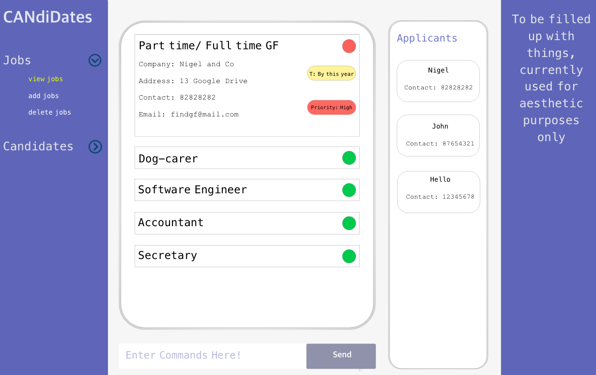
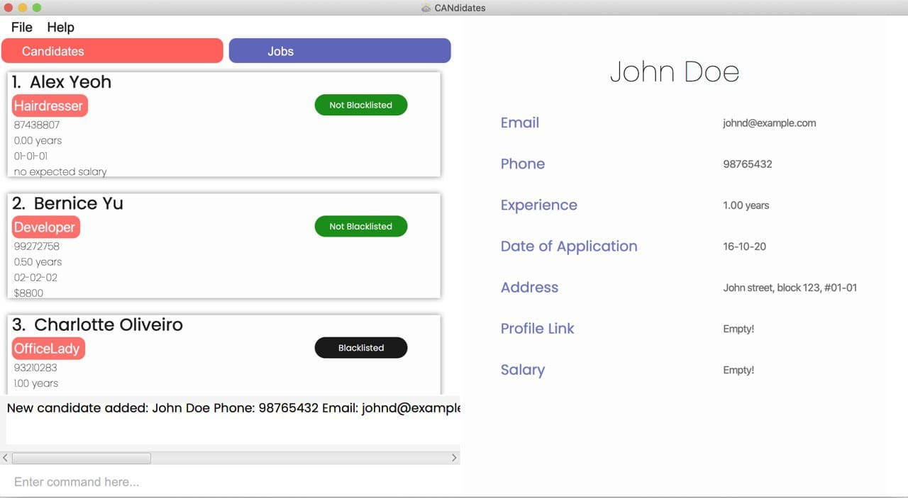
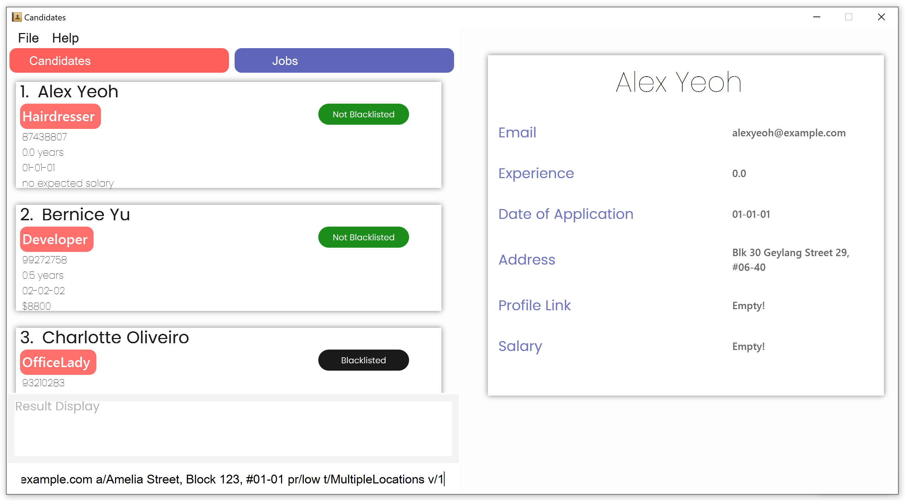
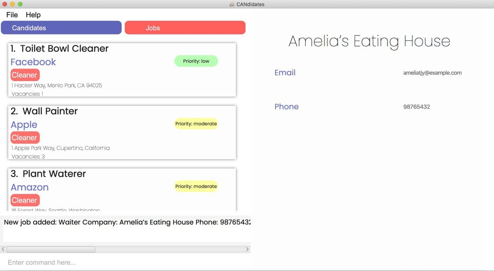
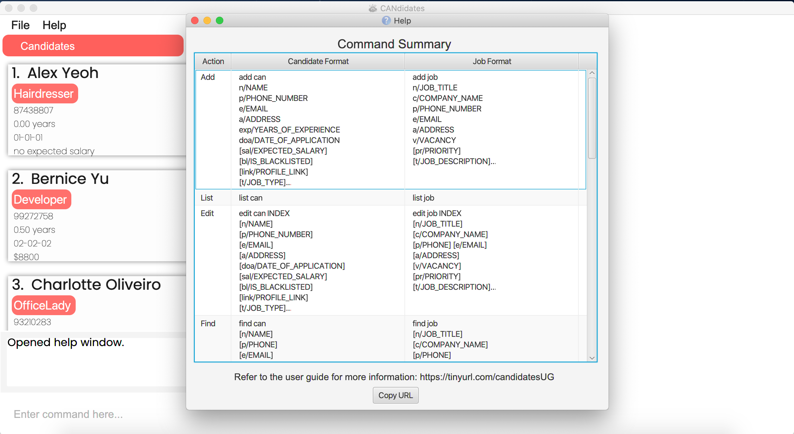
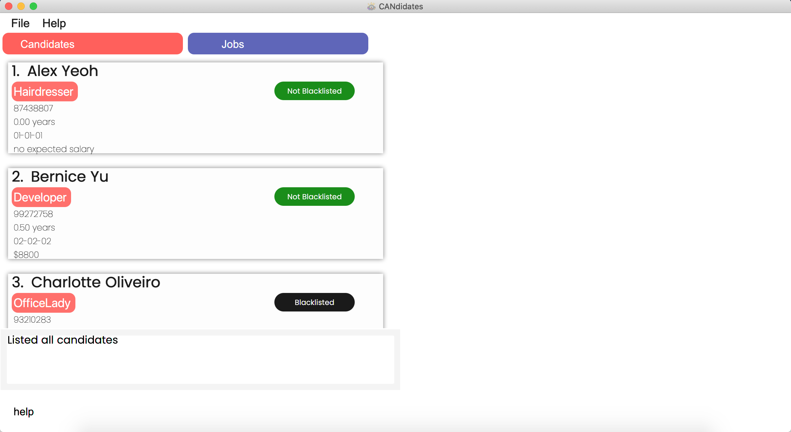
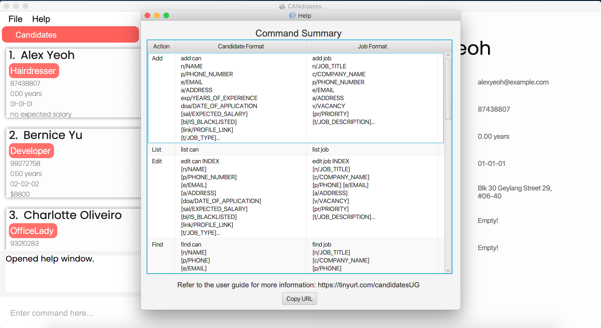
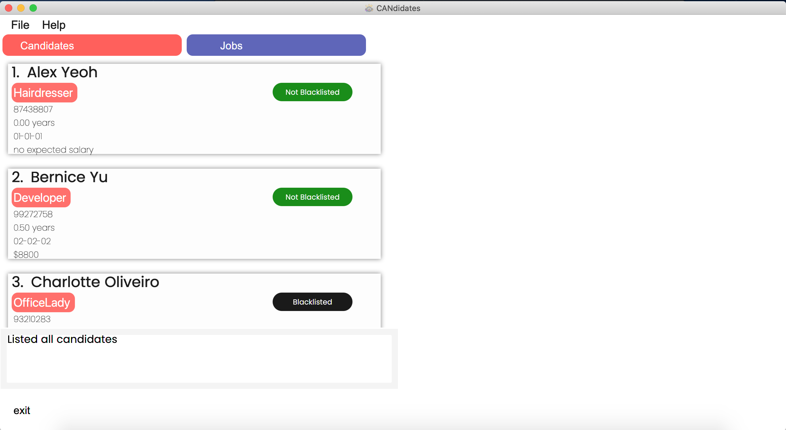

## CANdidates User Guide

1. [Introduction](#introduction)
     1. [Author](#authors)
1. [Preface](#preface)
     1. [Understanding Symbols](#understanding-symbols)
     1. [Understanding Input Fields](#understanding-input-fields)
     1. [Understanding Command Format](#understanding-command-format)
2. [Quick Start](#quick-start)
1. [Features for Candidates](#features-for-candidates)
    1. [Adding a candidate: **`add can`**](#adding-a-candidate-add-can)
    1. [Listing all candidates: **`list can`**](#listing-all-candidates-list-can)
    1. [Editing a candidate: **`edit can`**](#editing-a-candidate-edit-can)
    1. [Finding a candidate: **`find can`**](#finding-a-candidate-find-can)
    1. [Sorting all candidates: **`sort can`**](#sorting-all-candidates-sort-can)
    1. [Deleting a candidate: **`delete can`**](#deleting-a-candidate-delete-can)
    1. [Clearing all candidate entries: **`clear can`**](#clearing-all-candidate-entries-clear-can)
1. [Features for Jobs](#features-for-jobs)
    1. [Adding a job listing: **`add job`**](#adding-a-job-listing-add-job)
     1. [Listing all jobs: **`list job`**](#listing-all-jobs-list-job)
     1. [Editing a job: **`edit job`**](#editing-a-job-edit-job)
     1. [Finding a job: **`find job`**](#finding-a-job-find-job)
     1. [Sorting all jobs: **`sort job`**](#sorting-all-jobs-sort-job)
     1. [Deleting a job: **`delete job`**](#deleting-a-job-delete-job)
     1. [Clearing all job entries: **`clear job`**](#clearing-all-job-entries-clear-job)
1. [Other Features](#other-features)
     1. [Viewing help: **`help`**](#viewing-help-help)
     1. [Exiting the program : **`exit`**](#exiting-the-program--exit)
     1. [Detecting duplicate entries](#detecting-duplicate-entries)
     1. [Saving the data](#saving-the-data)
1. [FAQ](#faq)
1. [Command Summary](#command-summary)
1. [Glossary](#glossary)

 

--------------------------------------------------------------------------------------------------------------------

## Introduction
Hello there! If you are reading this, you must be curious about *CANdidates*. 

*CANdidates* is a powerful and optimized contact management app for job recruiters to manage job candidates and job listings. 
A key strength of *CANdidates* is its convenience and ease of managing all job-related contacts in a single application. 

If you find yourself having difficulty in managing job candidates and positions, then *CANdidates* is the perfect tool for you! 
Use this user guide to discover the amazing functions and features of *CANdidates*! 
Although *CANdidates* is simple and intuitive enough to use without having to read this user guide, 
we still recommend that you read through in order to fully utilise *CANdidates*. 

Before you get thrown off by some of the more technical terms used in this user guide, 
you may be happy to know that a glossary is provided at the end of this document and may be of help to you!

### Authors
*CANdidates* is developed as part of a NUS CS2103T Project by:

* [Amelia Tan Jin Yu](team/ameliatjy.md)
* [Lee Joon Jie](team/breadpeanutbutter.md)
* [Nigel Ng Yong Sheng](team/vangoghhh.md)
* [Tan Yu Ting, Germaine](team/g-erm.md)
* [Toh Hong Xian](team/raythx98.md)

 

--------------------------------------------------------------------------------------------------------------------

## Preface
For a smoother start to your usage of *CANdidates*, read this section to find out how this document is structured, 
how to navigate the document and what all the symbols, special fonts and command formats mean.

### Understanding Symbols
This section will explain all the symbols and fonts used in this document.

Symbols/Font  | Explanation
--------------|------------------------------------
**`command`** | A grey highlight means that you can type the words into *CANdidates* and it will start performing tasks.
:black_nib:   | This gives an example of how to use the feature.
:memo:        | This gives additional comments on the feature being explained.
:bulb:        | There are additional tips that you can make use of when using the explained feature.
:exclamation: | These are precautions you need to take note of when using the application.

### Understanding Input Fields
Input fields are fields that you have to specify in your commands. Still not sure what this means without context? 
Try getting a quick glance at the section [Quick Start](#quick-start) first!

You may refer back to this table whenever you need help understanding the input fields.

Name of input field   | How you can use them
----------------------|------------------------------------
`NAME`                | Name of candidate being added or edited. :memo: *Names should contain only alphanumerical values or spaces.*
`PHONE_NUMBER`        | Contact number of candidate or job listing being added or edited.
`EMAIL`               | Contact email address of candidate or job listing being added or edited. :exclamation: *This field does not guarantee that the email exists, only that the format is correct.* :bulb:*If you entered an erroneous email address, use the* [edit can](#editing-a-candidate-edit-can) *feature to correct it!*
`ADDRESS`             | Residential address of candidate or address of workplace for the job listing.
`YEARS_OF_EXPERIENCE` | Years of experience of the candidate in the relevant field one applied for. :memo: *You may key up to 2 decimal points excluding trailing zeroes.*
`DATE_OF_APPLICATION` | Date of job application submitted. :memo: *Date should be in the format of DD-MM-YY* :bulb: *Day and Month can be 1 or 2 digits as long as they are valid.* :black_nib: *If the date of application is 31 September 2021, input* `doa/31-9-21`
`EXPECTED_SALARY`     | If a candidate expects a certain amount of salary,  it can be specified using this field. :memo: *This field only accepts only whole numbers.* :bulb: *You could round up your figure to the next whole number if needed!*
`IS_BLACKLISTED`      | You may use this to blacklist candidates that are unresponsive, have poor attitude, etc. You can use this to sort or filter candidates. :memo: *This field only accepts 2 specific values: true or false.*
`PROFILE_LINK`        | URL link to candidate profile or portfolio (e.g. LinkedIn or GitHub, etc.) to provide convenience for you to refer to their profile later on.
`JOB_TYPE`            | You can include job type tags for candidates so that it will be easier to find candidates applying for similar jobs later on. For example, you can tag them according to the job industry. :memo: *Job type should be one word, made up of up to 20 alphanumerical values with no spaces.*
`JOB_TITLE`           | Title of a job position. :memo: *Job titles should contain only alphanumerical values or spaces.*
`COMPANY_NAME`        | Name of the company for the job listing you are adding or editing.
`VACANCY`             | Vacancy of a job listing i.e. Number of available slots open for hiring. :memo: *This field accepts only whole numbers from 0 to 99.*
`PRIORITY`            | Job listings may be of different urgency levels. For better categorisation, you may specify the priority of a job listing. :memo: *This field only accepts 3 specific values: low, moderate or high.*
`JOB_DESCRIPTION`     | You can include job description tags for job listings to specify additional description for it. For example, you may wish to specify restrictions on the listing such as age or gender. :memo: *Job description should be one word, made up of up to 20 alphanumerical values with no spaces.*
`FIELD_TO_SORT`       | Input field that is exclusive for [sort can](#sorting-all-candidates-sort-can) and [sort job](#sorting-all-jobs-sort-job) commands, to specify the field that the candidate or job list is being sorted by. :exclamation: *This field only takes in specific values described in the respective feature sections.*
`ORDER`               | Input field that is exclusive for [sort can](#sorting-all-candidates-sort-can) and [sort job](#sorting-all-jobs-sort-job) commands, to specify the sort order. :memo: *This field only accepts 2 specific values: asc or desc.*
`INDEX`               | Index number of the candidate or job displayed in the list.

### Understanding Command Format

This section will explain how to interpret all the command formats which you will encounter in the sections [Features for Candidates](#features-for-candidates), [Features for Jobs](#features-for-jobs) and [Other Features](#other-features).
This will help you to understand *CANdidates*' features better.

* Words in `UPPER_CASE` are the input fields which are supposed to be specified by you. 
  e.g. in `add n/NAME`, `NAME` is a input field which can be used as `add n/John Doe`.

* Items in square brackets are optional. 
  e.g `c/COMPANY_NAME [t/JOB_DESCRIPTION]` can be used as `c/Samsung t/ContractWorker` or just `c/Samsung`.

* Items with `…` after them can be used multiple times including zero times. You can put as much information as you want to! 
  e.g. `[t/JOB_TYPE]…` can be used as `t/accountant` (i.e. 1 time), `t/programmer t/technician` (i.e. 2 times) etc.

* Input fields can be in any order you want them to be. 
  e.g. if the command specifies `n/NAME p/PHONE_NUMBER`, `p/PHONE_NUMBER n/NAME` is also acceptable.

*:bulb: If you are confused with the various input fields, refer to [Understanding Input Fields](#understanding-input-fields).*

 

--------------------------------------------------------------------------------------------------------------------

## Quick Start
Can’t wait to start using *CANdidates*? This section guides you through the starting up process, so that you can proceed on to use the application for your own needs!

1. Download the latest `Candidates.jar` from [here](https://github.com/AY2021S1-CS2103T-T17-3/tp/releases/tag/v1.3).

1. Copy the file to the folder you want to use as the _home folder_ for your *CANdidates*.

1. Double-click the file to start the app. The GUI similar to the below should appear in a few seconds. Note how the app contains some sample data. 
   

1. Type the command in the command box and press Enter to execute it. e.g. typing **`help`** and pressing Enter will open the help window. 
   Some example commands you can try:

   * **`list can`** : Lists all candidates.

   * **`add can`**`n/John Doe p/98765432 e/johnd@example.com a/John street, block 123, #01-01 exp/5 doa/15-10-20` : 
   Adds a candidate named _John Doe_ with phone number _98765432_, email _johnd@example.com_, 
   address _John street, block 123, #01-01_, years of experience _5_ and date of application _15th October 2020_ to the candidates list.

   * **`delete can`**`3` : Deletes the 3rd candidate shown in the current candidates list.

   * **`clear can`** : Deletes all candidates.

   * **`exit`** : Exits the app.

1. Refer to the [Features](#features) below for details of each command.

:exclamation: *Ensure you have Java 11 or above installed in your Computer.*

:bulb: *If you are confused with the various input fields, refer to* [Understanding Input Fields](#understanding-input-fields).

 

--------------------------------------------------------------------------------------------------------------------

## Features for Candidates
This section provides you with features to handle all information of candidates for your utmost convenience!
 
Refer to [Other Features](#other-features) for more general features.

 

### Adding a candidate: `add can`

If you have a new candidate who approached you and you would like to put him in *CANdidates*, you can add him into the list using the command below.

Format: `add can n/NAME p/PHONE_NUMBER e/EMAIL a/ADDRESS exp/YEARS_OF_EXPERIENCE doa/DATE_OF_APPLICATION [t/JOB_TYPE]…​ [sal/EXPECTED_SALARY] [bl/IS_BLACKLISTED] [link/PROFILE_LINK]`

:bulb: *If you're unsure of what you are supposed to input in each field, refer to [Understanding Input Fields](#understanding-input-fields).*
 
:bulb: *A candidate can have 0 or more job type(s).*
 
:memo: *If the candidate is added successfully, *CANdidates* will automatically switch to the "Candidates" tab.*
 
:exclamation: *If `IS_BLACKLISTED` is not specified, it will be set to false by default.*

**Examples:**

:black_nib: To add a candidate with name _John Doe_, phone _98765432_, email _johnd@example.com_, address _John street, block 123, #01-01_, job type _DogGroomer_, with _1_ year of experience who applied on _16 October 2020_,

    add can n/John Doe p/98765432 e/johnd@example.com a/John street, block 123, #01-01 
    t/DogGroomer exp/1 doa/16-10-20

:black_nib: To add a candidate with name _Betsy Crowe_, email _betsycrowe@example.com_, address _NUS Temasek Hall_, phone _92920033_,  job types _HR_ and _OfficeLady_, with _5_ years of experience who applied on _10 October 2020_, with profile link _BetsyCrowe.com_, who will _not be blacklisted_ with an expected salary of _3000_,

    add can n/Betsy Crowe e/betsycrowe@example.com a/NUS Temasek Hall p/92920033 
    t/HR t/OfficeLady exp/5 doa/10-10-20 link/BetsyCrowe.com bl/false sal/3000
    
Step by Step:

Step 1. Type `add can n/John Doe p/98765432 e/johnd@example.com a/John street, block 123, #01-01 t/DogGroomer exp/1 doa/16-10-20` in the *command box* and press *Enter*.

Step 2. The *CANdidates* application will automatically switch to "Candidates" tab and display the message “New person added: John Doe Phone: 98765432 Email: johnd@example.com Experience: 1.0 years Date of Application: 16-10-20 Address: John street, block 123, #01-01 Link:  Expected Salary:  Blacklisted: false Tags: [DogGroomer]”.

Step 3. The application will show the updated list of candidates with the newly added candidate.

 

### Listing all candidates: `list can`

To accurately reflect the latest changes of candidates in the application, you can refresh the list of candidates using the format below.

Format: `list can`

:exclamation: *On the application, be sure to click on the “Candidates” tab to view the list of candidates.*

:bulb: *This command is usually used after a* [sort can](#sorting-all-candidates-sort-can) *or* [find can](#finding-a-candidate-find-can) *command to show the full list of candidates again.*

 

### Editing a candidate: `edit can`

If you would like to edit the details of a particular candidate, you can use the command below

Format: `edit can INDEX [n/NAME] [p/PHONE] [e/EMAIL] [a/ADDRESS] [doa/DATE_OF_APPLICATION] [sal/EXPECTED_SALARY] [bl/IS_BLACKLISTED] [link/PROFILE_LINK] [t/JOB_TYPE]…`

:memo: *Edits the candidate at the specified* `INDEX`. *The* `INDEX` *refers to the index number shown in the displayed candidate list. The* `INDEX` *must be a positive integer 1, 2, 3, …​*
 
:memo: *Existing values will be updated to the input values.*
 
:memo: *At least one of the optional fields must be provided.*
 
:memo: *The blacklist input can be specified as* `bl/true` *or* `bl/false`.
 
:exclamation: *When editing the job type, the existing job types will be cleared and replaced, i.e editing of job types is not cumulative even though there can be multiple job types.*
 
:bulb: *Certain optional candidate fields can be cleared by typing their respective prefixes without specifying any value after them. 
This works for the job type, address, expected salary and profile link fields. See the second example below for a demonstration.*

**Examples:**

:black_nib: To edit the 1st candidate’s phone number, email and blacklist status to be _91234567_, _johndoe@example.com_ and _true_ respectively,

    edit can 1 p/91234567 e/johndoe@example.com bl/true

:black_nib: To edit the 2nd candidate and clear existing job types, address, expected salary and profile link,

    edit can 2 t/ a/ sal/ link/ 
    
 

### Finding a candidate: `find can`

Too many candidates with different information? *CANdidates* provide you with a simple and quick way for you to find candidates who fulfil certain criteria(s) or even a specific candidate from the long list. All you have to do is tell CANdidates the field you are interested in, along with the keyword you are looking for!

Format: `find can [n/NAME] [p/PHONE] [e/EMAIL] [a/ADDRESS] [exp/YEARS_OF_EXPERIENCE] [doa/APPLICATION_DATE] [sal/EXPECTED_SALARY] [bl/IS_BLACKLISTED] [link/PROFILE_LINK] [t/JOB_TYPE]…`

:memo: *At least one of the optional fields must be provided.*
 
:memo: *The search is case insensitive, e.g. john will match John*
 
:memo: *The order of the keywords does not matter, e.g. Doe John will match John Doe*
 
:memo: *For number fields (i.e. phone, years of experience and expected salary), only exact matching results will be displayed. For the remaining fields, results containing and exactly matching the keywords will be displayed.*
 
:bulb: *If you do not want to see blacklisted candidates in the list, you can use the command find can bl/false, the resulting list will show only non-blacklisted candidates.*

 

### Sorting all candidates: `sort can`

You can view all the candidates in the order you wish to by typing in your desired order. Upon execution of the command, the sorted list of candidates would be displayed on the app!

Format: `sort can type/FIELD_TO_SORT order/ORDER`

:exclamation: *Sorting will only apply to the current viewable list. e.g. Using* `sort can` *command after a* `find can` *command will only sort the list of candidates that were listed after the* `find can` *command.*
 
:memo: *The type input must be one of* `type/exp`, `type/sal`, `type/bl` *or* `type/doa` *depending on whether you wish to sort the candidates by their experience, expected salary, blacklist status or data of application respectively.*
 
:memo: *The order input must be specified as either* `order/asc` *or* `order/desc` *depending on whether you wish the sorting to be done in an ascending or descending manner.*
 
:memo: *If you provide more than one* `FIELD_TO_SORT` *or* `ORDER` *, only the last one will be taken in as input e.g.* `sort can type/exp order/asc type/sal order/desc` *will sort the candidates according to expected salary in descending order.* 
 

**Examples:**

:black_nib: To sort the list of candidates starting from the lowest number of years of experience,

    sort can type/exp order/asc

:black_nib: To sort the list of candidates starting from the most recent application date,

    sort can type/doa order/desc

:black_nib: To view all blacklisted candidates followed by non-blacklisted candidates,

    sort can type/bl order/desc
    
 

### Deleting a candidate: `delete can`

Have you successfully found a job for a candidate and you no longer need to keep his/her details in *CANdidates*? 
To delete a particular candidate from the list, you can use the command below.

Format: `delete can INDEX`

:memo: *Deletes the candidate at the specified* `INDEX`. *The* `INDEX` *refers to the index number shown in the displayed job list. The* `INDEX` *must be a positive integer 1, 2, 3, …​*
 
:exclamation: *The specified candidate’s data will be cleared and this action is irreversible. 
Please ensure you do not require the candidate’s data anymore before performing this command.*

**Examples:**

:black_nib: To delete the candidate at index _1_,

    delete can 1

:black_nib: To delete the candidate at index _3_,

    delete can 3
    
 

### Clearing all candidate entries: `clear can`

Want to clear all the candidates in the list quickly without having to delete one by one? Simply use the command below!

Format: `clear can`

:exclamation: *All candidate data will be cleared and this action is irreversible. 
Please ensure you do not require the candidate list data anymore before performing this command.*
 
:bulb: *This command can be used to clear the sample data on CANdidates when you first download it.*

 

## Features for Jobs
This section provides you with features to handle all information of job listings for your utmost convenience!
 
Refer to [Other Features](#other-features) for more general features.

 
       
### Adding a job listing: `add job`

If you are informed of a job opening and you would like to add it in *CANdidates*, you can add it into the list using the command below.

Format: `add job n/JOB_TITLE c/COMPANY_NAME p/PHONE_NUMBER e/EMAIL a/ADDRESS v/VACANCY [t/JOB_DESCRIPTION]… [pr/PRIORITY]`

:bulb: *If you're unsure of what you are supposed to input in each field, refer to [Understanding Input Fields](#understanding-input-fields).*
 
:bulb: *A job can have 0 or more job description(s).*
 
:memo: *If the job is added successfully, *CANdidates* will automatically switch to the "Jobs" tab*
 
:exclamation: *If `PRIORITY` is not specified, it will be set to moderate by default.*

**Examples:**

:black_nib: To add a job with job title _Waiter_, company name _Amelia’s Eating House_, phone _98765432_, email _ameliatjy@example.com_, address _Amelia Street, Block 123, #01-01_, priority _low_, job description _MultipleLocations_ and with _1_ vacancy,

    add job n/Waiter c/Amelia’s Eating House p/98765432 e/ameliatjy@example.com 
    a/Amelia Street, Block 123, #01-01 pr/low t/MultipleLocations v/1

:black_nib: To add a job with job title _Delivery Man_, company name _FedEx_, email _fedex@example.com_, address _Joo Koon_,phone _93333222_, priority _high_, job descriptions _delivery_ and _west_, with _1_ vacancy,

    add job n/Delivery Man c/FedEx e/fedex@example.com a/Joo Koon p/93333222 
    pr/high t/delivery t/west v/10
    
Step by Step:

Step 1. Type `add job n/Waiter c/Amelia’s Eating House p/98765432 e/ameliatjy@example.com a/Amelia Street, Block 123, #01-01 pr/low t/MultipleLocations v/1` in the *command box* and press *Enter*.

Step 2. The *CANdidates* application will automatically switch to "Jobs" tab and display the message “New job added: Waiter Company: Amelia’s Eating House Phone: 98765432 Email: ameliatjy@example.com Address: Amelia Street, Block 123, #01-01 Priority: low Vacancy: 1 Tags: [MultipleLocations]”.

Step 3. The application will show the updated job listings with the newly added job.
    
 

### Listing all jobs: `list job`

To accurately reflect the latest changes of jobs in the application, you can refresh the job listings using the format below.

Format: `list job`

:exclamation: *On the application, be sure to click on the “Jobs” tab to view the job listings.*

:bulb: *This command is usually used after a* [sort job](#sorting-all-jobs-sort-job) *or* [find job](#finding-a-job-find-job) *command to show the full list of job listings again.*

 

### Editing a job: `edit job`

If you would like to edit the details of a particular job, you can use the command below

Format: `edit job INDEX [n/JOB_TITLE] [c/COMPANY_NAME] [p/PHONE] [e/EMAIL] [a/ADDRESS] [v/VACANCY] [pr/PRIORITY] [t/JOB_DESCRIPTION]…`

:memo: *Edits the job at the specified* `INDEX`. *The* `INDEX` *refers to the index number shown in the displayed job list. The* `INDEX` *must be a positive integer 1, 2, 3, …​*
 
:memo: *Existing values will be updated to the input values.*
 
:memo: *At least one of the optional fields must be provided.*
 
:memo: *The priority input can be specified as* `pr/low`, `pr/moderate` *or* `pr/moderate`.
 
:exclamation: *When editing the job description, the existing job descriptions will be cleared and replaced, 
i.e editing of job descriptions is not cumulative even though there can be multiple job descriptions.*
 
:bulb: *Existing job descriptions can be cleared by typing t/ without specifying any value after it. 
See the second example below for a demonstration.*

**Examples:**

:black_nib: To edit the 2nd job’s company name, phone number, vacancy and priority to be _Dog Cafe_, _82827731_, _3_ and _high_ respectively,

    edit job 2 c/Dog Cafe p/82827731 v/3 pr/high

:black_nib: To edit the 3rd job and clear existing job descriptions, 

    edit job 3 t/
    
 

**Examples:**

:black_nib: To find candidates with tag(s) containing the word “_developer_” and an expected salary of exactly _$4000_,

    find can t/developer sal/4000

:black_nib: To find candidates who are _blacklisted_,

    find can bl/true
    
 

### Finding a job: `find job`

Too many job listings with different information? Similar to the feature above, you can also find job listings by inserting keywords for the fields you are looking for!

Format: `find job [n/JOB_TITLE] [c/COMPANY_NAME] [p/PHONE] [e/EMAIL] [a/ADDRESS] [pr/PRIORITY] [v/VACANCY] [t/JOB_DESCRIPTION]…`

:memo: *At least one of the optional fields must be provided.*
 
:memo: *The search is case insensitive, e.g. samsung will match Samsung*
 
:memo: *The order of the keywords does not matter, e.g. King Burger will match Burger King*
 
:memo: *For number fields (i.e. phone and vacancy), only exact matching results will be displayed. For the remaining fields, results containing and exactly matching the keywords will be displayed.*

**Examples:**

:black_nib: To find jobs with email containing “_@gmail.com_” and priority level _high_,

    find job e/@gmail.com pr/high

:black_nib: To find jobs with job titles containing the words “_Software Engineer_”,

    find job n/Software Engineer
    
 

### Sorting all jobs: `sort job`

Have too many job listings and need a way to organise them? You can get *CANdidates* to help you do that by sorting them according to the priority or vacancies you have indicated for the job listings!

Format: `sort job type/FIELD_TO_SORT order/ORDER`

:exclamation: *Sorting will only apply to the current viewable list. e.g. Using* `sort job` *command after a* `find job` *command will only sort the list of job listings that were listed after the* `find job` *command.*
 
:memo: *The* `FIELD_TO_SORT` *can be either* `pr` *or* `v` *depending on whether you wish to sort the job listings by their priority level or number of vacancies.*
 
:memo: *If you provide more than one* `FIELD_TO_SORT` *or* `ORDER` *, only the last one will be taken in as input e.g.* `sort job type/pr order/asc type/v order/desc` *will sort the job listings according to vacancies in descending order.* 
 
:memo: *The* `ORDER` *can be either* `asc` *or* `desc` *depending on whether you wish the sorting to be done in an ascending or descending manner.*

**Examples:**

:black_nib: To sort the list of jobs starting from lowest priority,

    sort job type/pr order/asc

:black_nib: To sort the list of jobs starting from the highest number of vacancies,

    sort job type/v order/desc
    
Step by Step:

Step 1. Type sort job type/pr order/asc in the command box and press Enter.

Step 2. The *CANdidates* application will display the message “Successfully sorted jobs by priority in ascending order.”

Step 3. The application will show the sorted job list based on the sort condition given.

 

### Deleting a job: `delete job`

Deletes the specified job from the job listing.

Format: `delete job INDEX`

:memo: *Deletes the job at the specified* `INDEX`. *The* `INDEX` *refers to the index number shown in the displayed job list. The* `INDEX` *must be a positive integer 1, 2, 3, …​*
 
:exclamation: *The specified job’s data will be cleared and this action is irreversible. 
Please ensure you do not require the job’s data anymore before performing this command.*

**Examples:**

:black_nib: To delete the job at index _1_,

    delete job 1

:black_nib: To delete the job at index _3_,

    delete job 3
    
 

### Clearing all job entries: `clear job`

Want to clear all the jobs in the list quickly without having to delete one by one? Simply use the command below!

Format: `clear job`

:exclamation: *All job data will be cleared and this action is irreversible. 
Please ensure you do not require the job list data anymore before performing this command.*
 
:bulb: *This command can be used to clear the sample data on* *CANdidates* *when you first download it.*

 

## Other Features
This section explores other general features that CANdidates has to offer!

 

### Viewing help: `help`

If you are unsure of how to use the application, we have a help function that will direct you to our user guide! You might also find it helpful to refer to the summary of all the available commands [here](#command-summary).

***Image to be changed***

Format: `help`

Step by Step:

Step 1. Type `help` in the *command box* and press *Enter*.

Step 2. The *CANdidates* application will display the message "Opened help window" to indicate that the help window has been opened.

Step 3. The help window will appear as a pop-up and you may click on the "copy URL" button. This URL (link) will direct you to *CANdidates*'s user guide, which is this document!

 

### Exiting the program : `exit`

Done with updating your information with *CANdidates*? Use this command to exit the program!

Format: `exit`

 

### Detecting duplicate entries

Worried that you might accidentally create duplicate entries of the same candidate or job? No need to worry, 
CANdidates has you covered! Duplicate entries are automatically detected and prevented from being created. 
You will be notified by an error message when this happens. No command is needed.

:memo: *For candidates, duplicates are defined as entries with the same name and phone number or same name and email.*
 
:memo: *For jobs, duplicates are defined as entries with the same job title and company name.*
 
:memo: *Detection and prevention of duplicates apply when adding entries as well as editing entries. 
This means you will not be able to edit an entry to match another entry.*

**Examples:**

:black_nib: Creating candidates with the same name and phone is not allowed

    add can n/Rob p/12345 e/rob@mail.com exp/4 doa/08-08-22
    
    add can n/Rob p/12345 e/robby@gmail.com exp/3.5 doa/09-08-22

:black_nib: Creating jobs with the same job title and company name is not allowed

    add job n/Actor c/Hollywood Pte Ltd  p/8888 e/h@mail.com a/Serangoon v/3
     
    add job n/Actor c/Hollywood Pte Ltd p/1234 e/g@mail.com a/Nex v/3

 

### Saving the data

All data is saved in the hard disk automatically after any command that changes the data. No need worry about having to save manually!

 

--------------------------------------------------------------------------------------------------------------------

## FAQ

**Q**: How do I transfer my data to another Computer? 
**A**: Install the app in the other computer and overwrite the empty data file it creates with the file that contains the data of your previous CANdidates home folder.

**Q**: How do I report a bug I encountered? 
**A**: Send an email to *developers@CANdidates.com* with a description and screenshot (if relevant) of the bug. We will make sure to get back to you promptly!

**Q**: How can I contribute to this project? 
**A**: You may create a pull request to this [repository](https://github.com/AY2021S1-CS2103T-T17-3/tp). Here is our [developer's guide](https://ay2021s1-cs2103t-t17-3.github.io/tp/DeveloperGuide.html) for your reference.

 

--------------------------------------------------------------------------------------------------------------------

## Command Summary

This handy command summary table provides you with all the possible commands for *CANdidates* at one glance.

Action | Candidate Format | Job Format
--------|------------------|------------------
**Add** | `add can n/NAME p/PHONE_NUMBER e/EMAIL a/ADDRESS exp/YEARS_OF_EXPERIENCE doa/DATE_OF_APPLICATION [sal/EXPECTED_SALARY] [bl/IS_BLACKLISTED] [link/PROFILE_LINK] [t/JOB_TYPE]…` | `add job n/JOB_TITLE c/COMPANY_NAME p/PHONE_NUMBER e/EMAIL a/ADDRESS v/VACANCY [pr/PRIORITY] [t/JOB_DESCRIPTION]…`
**List** | `list can` | `list job`
**Edit** | `edit can INDEX [n/NAME] [p/PHONE_NUMBER] [e/EMAIL] [a/ADDRESS] [doa/DATE_OF_APPLICATION] [sal/EXPECTED_SALARY] [bl/IS_BLACKLISTED] [link/PROFILE_LINK] [t/JOB_TYPE]…` | `edit job INDEX [n/JOB_TITLE] [c/COMPANY_NAME] [p/PHONE] [e/EMAIL] [a/ADDRESS] [v/VACANCY] [pr/PRIORITY] [t/JOB_DESCRIPTION]…`
**Find** | `find can [n/NAME] [p/PHONE] [e/EMAIL] [a/ADDRESS] [exp/EXPERIENCE] [doa/APPLICATION_DATE] [sal/EXPECTED_SALARY] [bl/IS_BLACKLISTED] [link/PROFILE_LINK] [t/JOB_TYPE]…` | `find job [n/JOB_TITLE] [c/COMPANY_NAME] [p/PHONE] [e/EMAIL] [a/ADDRESS] [pr/PRIORITY] [v/VACANCY] [t/JOB_DESCRIPTION]…`
**Sort** | `sort can type/FIELD_TO_SORT order/ORDER` | `sort job type/FIELD_TO_SORT order/ORDER`
**Delete** | `delete can INDEX` | `delete job INDEX`
**Clear** | `clear can` | `clear job`
**Help** | `help` | `help`
**Exit** | `exit` | `exit`

 

--------------------------------------------------------------------------------------------------------------------

## Glossary

Terms | Explanation
--------|------------------------------------
**Java** | Java is a widely-used programming language that developers use to create applications on computers.
**GUI** | A GUI (Graphical User Interface) is a system of interactive visual components for computer software. It is the visible component of the software.
**Input field** | Input to the command that the user specifies.
**Cumulative** | Increasing in quantity by successive additions.
**Hard disk** | Storage of information in a computer.
**Repository** | Online container where your code can be stored, contributed to and managed over time.
**Pull Request** | Formal request to merge one’s code into a larger codebase.
**Bug** | A software bug is an error, flaw or fault in a computer program or system that causes it to produce an incorrect or unexpected result, or to behave in unintended ways.
**Developer's Guide** | A guide that includes extensive guidance and reference materials to aid the developer in creating applications and extensions 
